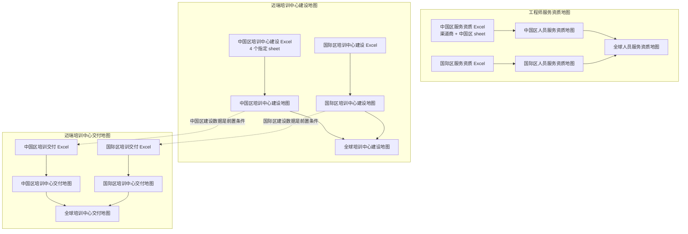
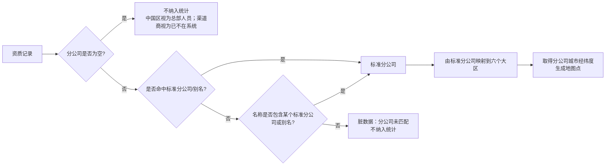
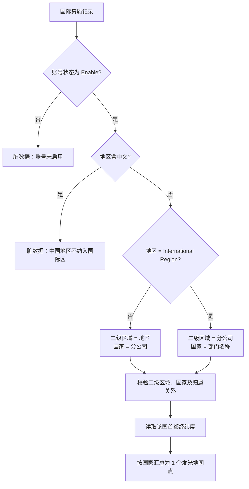
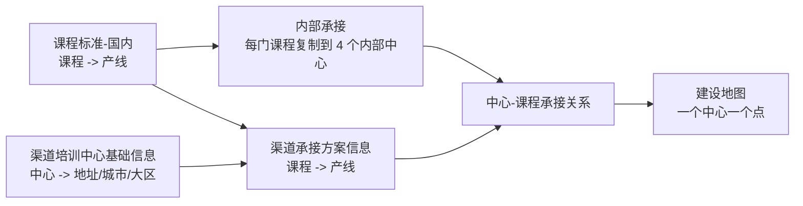
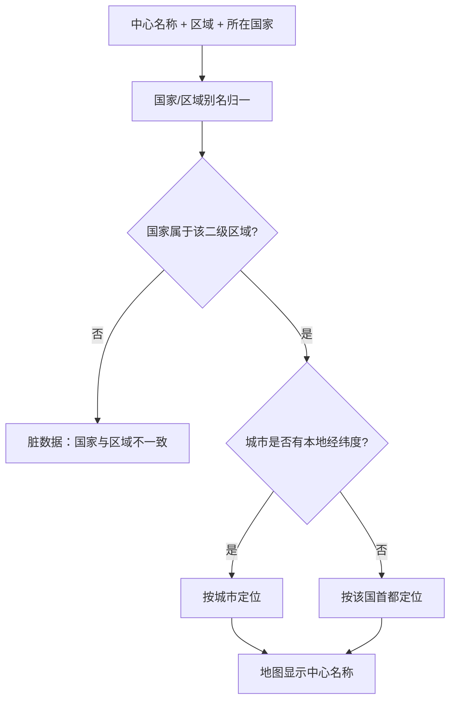
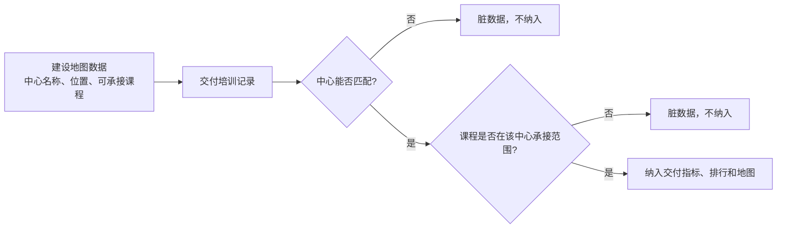
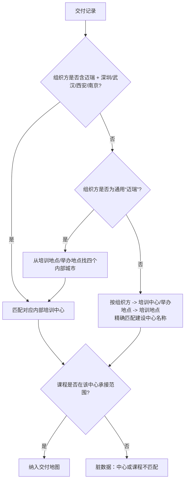
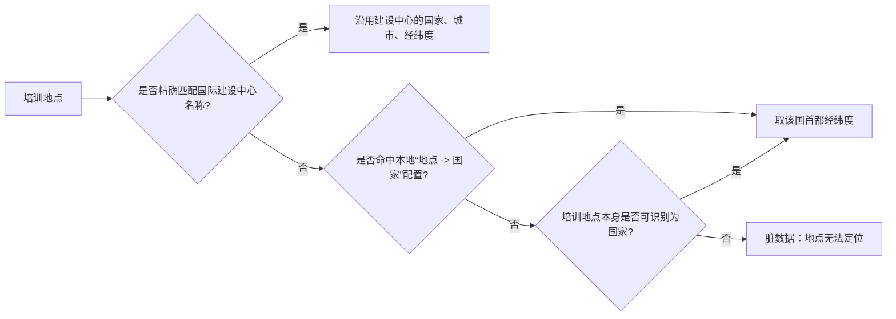

# 地图 Excel 导入业务逻辑说明

> 适用范围：工程师服务资质地图、迈瑞培训中心建设地图、迈瑞培训中心交付地图。  
> 读者：负责准备或复核 Excel 数据的业务同事。  
> 本文只说明业务口径、字段用途、匹配规则和异常处理，不涉及底层程序实现。

## 1. 先理解整体关系

系统中没有一份单独的“全球地图 Excel”。全球页是把**已导入的中国区数据**和**已导入的国际区数据**放在同一张世界地图上展示；两套源数据彼此独立，替换其中一份不会改动另一份。



### 1.1 通用导入规则

1. 系统会先识别表头，而不是要求表头必须在第一行。表头附近的空格、括号、下划线、短横线等格式差异会被忽略。
2. 同一业务字段可使用常见别名。例如“产品线”“产线”会被视为同类字段；详细可用名称见后面的字段表。
3. 空白行不会计入导入。
4. 每条纳入数据都会保留来源文件、Sheet 名和 Excel 行号，便于追溯。
5. 未纳入统计的行会进入“脏数据”。导出脏数据时，文件同时包含：异常类别、异常原因、来源文件、Sheet、行号和**完整原始行数据**。
6. 三类地图的筛选器均为多选联动：
   - 默认“全部”表示该维度的所有当前有效选项均已选中。
   - 选择某个条件后，其他筛选器只保留与该条件有真实数据关联的选项。
   - 后面筛选条件不会覆盖前面已经选择的条件；若某项因其他选择而不再有数据，系统自动清除该无效选择。
   - 点击“查询”时，每个筛选器必须有选择；“全部”属于已选择状态。

---

# 2. 工程师服务资质地图

## 2.1 三个页面之间的关系

| 页面 | 是否直接导入 Excel | 地图点代表什么 | 筛选器 |
| --- | --- | --- | --- |
| 全球人员服务资质地图 | 否。复用中国区和国际区最新导入数据 | 中国区为分公司，国际区为国家首都点 | 无独立筛选器 |
| 中国区人员服务资质地图 | 是 | 分公司 | 大区、分公司、渠道商、产品线、机器型号、资质类型 |
| 国际区人员服务资质地图 | 是 | 国家，以首都经纬度定位 | 二级区域、国家、产线、子产线、机型大类、资质类型 |

全球页仅做合并展示：不会把中国区记录改写为国际区口径，也不会新增或删除任一来源数据。

## 2.2 中国区人员服务资质地图

### 2.2.1 读取范围

推荐文件：`202601+服务资质报表.xlsx`。

正常情况下只读取以下两个 Sheet，并合并统计：

| Sheet | 表示的业务数据 | 是否纳入统计 |
| --- | --- | --- |
| `渠道商` | 渠道商/分包商工程师资质 | 是 |
| `中国区` | 中国区内部员工资质 | 是 |
| `国际区` | 国际区资质 | 否 |

若上游文件未使用上述标准 Sheet 名，系统会尝试读取除“国际区”以外且能识别出资质表头的 Sheet；业务上仍建议固定使用标准命名，避免误读不相关工作表。

### 2.2.2 字段读取和用途

| 业务字段 | 优先读取的列名 | 可识别的常见别名 | 如何使用 |
| --- | --- | --- | --- |
| 人工编号 | `人工编号` | 员工/分包商/经销商编号、员工编号、人员编号、工号 | 与员工名称共同组成持证人数去重键 |
| 员工名称 | `员工/分包商/经销商名称` | 人员姓名、姓名、员工姓名、工程师姓名 | 与人工编号共同组成持证人数去重键；为空时可用渠道商名称兜底显示 |
| 渠道商名称 | `分包商名称` 或 `渠道商名称` | 渠道商、经销商 | 仅渠道商 Sheet 用于“渠道商”筛选和“覆盖渠道商”统计 |
| 渠道商编码 | `分包商编码` 或 `渠道商编码` | 渠道编码 | 保留在明细中，用于追溯，不参与核心汇总 |
| 分公司 | `所属分公司` | 分公司、所属公司 | 决定中国区地图点和大区归属，是纳入统计的关键字段 |
| 原始区域 | `区域` | 大区 | 仅保留用于追溯；最终大区以分公司本地映射为准 |
| 产品线 | `产品线描述` | 产品线、大产线、产线、部门 | 优先用描述列；用于筛选、分布图和详情 |
| 机器型号 | `机器型号` | 型号、机型 | 用于筛选和明细 |
| 资质类型 | `服务资质类别描述` | 服务资质类型、资质类型、服务资质类别 | 用于筛选和资质类型分布；缺失时使用服务资质类别编码 |
| 资质起始日期 | `有效起始日期` | 有效开始日期、资质有效起始日期 | 详情和导出展示 |
| 资质截止日期 | `有效截止日期` | 资质有效期、有效期、截止日期、有效截止时间 | 计算资质是否有效、即将到期或已过期 |

其中，**产品线、机器型号、资质类型、资质截止日期**是可识别一张资质表的核心字段。缺少这些字段的 Sheet 不会纳入。

### 2.2.3 分公司和大区如何确定

系统不会再依据渠道商地址推测分公司。分公司只来自 Excel 的“所属分公司/分公司”字段，并按本地维护的标准分公司表归一。



标准大区只有以下六个，不存在“华中大区”：

| 大区 | 标准分公司 |
| --- | --- |
| 东北大区 | 沈阳、黑吉、大连、内蒙古 |
| 华北大区 | 北京、石家庄、天津、济南、青岛、北京战略客户部 |
| 华东大区 | 武汉、杭州、上海、苏州、南京、合肥 |
| 西北大区 | 西安、兰州、新疆、太原、郑州 |
| 西南大区 | 成都、贵阳、昆明、重庆、南宁 |
| 华南大区 | 长沙、南昌、福州、广州、深圳、海南 |

常见别名会先归一，例如：

| 原始分公司写法 | 归一后的标准分公司 |
| --- | --- |
| 哈尔滨分公司、长春分公司、吉林分公司 | 黑吉分公司 |
| 乌鲁木齐分公司 | 新疆分公司 |
| 呼和浩特分公司 | 内蒙古分公司 |
| 无锡分公司、南通分公司、徐州分公司 | 南京分公司 |
| 宁波分公司、温州分公司 | 杭州分公司 |
| 东莞分公司、佛山分公司 | 广州分公司 |
| 洛阳分公司 | 郑州分公司 |

“总部”“深圳总部”“中国区总部”等会识别为“深圳总部（内部）”，但其不属于六个大区的分公司范围，因此不进入本地图统计与分公司筛选器。

### 2.2.4 渠道商如何使用

- 只有来源 Sheet 为`渠道商`的记录才会进入渠道商筛选器和“覆盖渠道商”统计。
- `中国区`Sheet 的内部员工不会显示为“中国区（非渠道）”，也不会被塞入渠道商选项。
- 选定具体渠道商后，只看该渠道商资质，不混入中国区内部员工。
- “覆盖渠道商” = 当前筛选结果中，渠道商名称去重后的数量。

### 2.2.5 资质状态和指标

资质截止日期会与导入当天比较：

| 截止日期相对今天 | 状态 | 是否算有效资质 |
| --- | --- | --- |
| 已早于今天 | 已过期 | 否 |
| 0-30 天 | 30天内到期 | 是 |
| 31-60 天 | 60天内到期 | 是 |
| 61-90 天 | 90天内到期 | 是 |
| 超过 90 天 | 有效 | 是 |
| 日期无法识别 | 未识别 | 否 |

页面指标按当前筛选结果计算：

| 指标 | 计算口径 |
| --- | --- |
| 总持证人数 | 按`人工编号 + 员工名称`去重；两者都为空时才以分公司、组织、来源行兜底，避免空值合并 |
| 有效资质总数 | 状态为有效、30/60/90 天内到期的记录数；两个 Sheet 合计 |
| 覆盖分公司数 | 有纳入记录的标准分公司数量 |
| 覆盖渠道商 | 渠道商 Sheet 中渠道商名称去重后的数量 |

地图每个点对应一个分公司。点的统计是该分公司当前筛选条件下的持证人数、有效资质数、覆盖渠道商和到期风险；点位使用本地维护的分公司城市经纬度。

### 2.2.6 中国区服务资质脏数据

下列情形不会计入地图和汇总：

- Sheet 未识别到有效表头，或缺少产品线、机器型号、资质类型、截止日期等关键字段。
- 分公司为非空值，但不能归一到六大区内的标准分公司。这类记录会进入“导出脏数据”。
- 分公司为空、归为“深圳总部（内部）”，或为明确排除的外文/非中国区分公司。这类记录按业务规则直接排除，不显示在地图和统计中；当前脏数据导出不一定包含它们。

可导出的脏数据用于回传数据维护方；每条都保留整行原表值和未纳入原因。

## 2.3 国际区人员服务资质地图

推荐文件：`渠道商和员工-MCSR&CCAC&MCST-20260623.xlsx`。系统扫描工作簿中能识别到完整国际资质表头的 Sheet。

### 2.3.1 字段读取和用途

| Excel 列 | 业务用途 |
| --- | --- |
| `账号`或`人工编号` | 工程师去重主标识 |
| `姓名` | 与账号共同构成工程师去重键；缺失时可用渠道商名称显示 |
| `账号状态` | 仅`Enable`账号纳入统计；`Disable`和其他状态进入脏数据 |
| `地区` | 通常作为二级区域来源 |
| `分公司` | 通常作为国家来源 |
| `部门名称` | 当“地区”为`International Region`时，作为国家来源 |
| `产线` | 产品线筛选与分布 |
| `子产线` | 子产线筛选与分布 |
| `机型大类` | 机型大类筛选 |
| `资质类型` | 资质类型筛选与分布 |
| `有效截止日期` | 计算资质状态和有效资质 |
| `渠道商名称` | 覆盖渠道商统计 |

### 2.3.2 二级区域、国家和地图点的判定



纳入前还会校验：

- 二级区域必须存在于全球区域架构配置中。
- 国家必须能够归一为世界地图中的国家。
- 国家必须属于该二级区域；不一致的行不纳入。
- 该国家必须有离线世界地图边界和首都经纬度。

国际区地图点不是人员点，而是**国家点**：同一国家所有合格资质记录汇总为一个点，显示在该国首都附近。首都坐标来源于本地配置，因此无需在线地图 Key。

### 2.3.3 国际区指标

| 指标 | 计算口径 |
| --- | --- |
| Certified Engineers | 按`账号 + 姓名`去重 |
| Valid Qualifications | 当前有效资质记录数 |
| Covered Countries | 当前筛选结果中有记录的国家数 |
| Covered Partners | 渠道商名称去重数 |

## 2.4 全球服务资质地图如何合并

- 中国区数据仍按分公司展示，使用中国城市坐标。
- 国际区数据仍按国家展示，使用国家首都坐标。
- 全球指标为两套数据的汇总；同名地点不会因为“全球”页面而改变原来的国家或分公司归属。
- 全球页不要求再次上传 Excel；只要中国区和国际区源数据均已导入，就能自动刷新。

---

# 3. 迈瑞培训中心建设地图

## 3.1 三个页面之间的关系

| 页面 | 数据来源 | 地图点代表什么 |
| --- | --- | --- |
| 全球培训中心建设地图 | 已导入的中国区建设数据 + 国际区建设数据 | 培训中心 |
| 中国区培训中心建设地图 | 中国区建设 Excel | 内部培训中心或渠道培训中心 |
| 国际区培训中心建设地图 | 国际区建设 Excel | 国际培训中心 |

建设地图回答的是：**某个培训中心在哪里、能够承接哪些课程、覆盖哪些产线，以及是否已签约。**它不是培训发生次数统计。

## 3.2 中国区培训中心建设地图

推荐文件：`渠道培训中心信息盘点.xlsx`。一个工作簿必须同时包含以下四个 Sheet：

| Sheet | 业务作用 | 是否必需 |
| --- | --- | --- |
| `课程标准-国内` | 建立“课程 - 产线”的标准目录 | 是 |
| `渠道培训中心基础信息` | 维护渠道培训中心名称、地址和详情 | 是 |
| `内部承接` | 声明四个内部培训中心共同承接的课程 | 是 |
| `渠道承接方案信息` | 声明每个渠道培训中心承接的课程 | 是 |



### 3.2.1 `课程标准-国内`：课程标准目录

| Excel 列 | 是否关键 | 使用方式 |
| --- | --- | --- |
| `课程名称（下单使用）` | 是 | 标准课程名；与内部/渠道承接课程进行去空格、括号归一后的精确匹配 |
| `主产线` | 是 | 课程所属产品线；输出为`IVD`、`MIS`或`PMLS` |
| `子产线` | 否 | 中心详情和后续追溯展示 |
| `机型大类` | 否 | 中心详情和后续追溯展示 |
| `训后授予的资质类型` | 否 | 中心详情和后续追溯展示 |
| `需要的样机型号` | 否 | 中心详情和后续追溯展示 |
| `备注` | 否 | 中心详情和后续追溯展示 |

产线的优先级如下：

1. 优先以`主产线`为准。
2. `PLMS`会统一为系统标准值`PMLS`。
3. 若课程不在标准目录中，才使用本地课程名称规则补充识别。例如超声归`MIS`，监护、麻醉、呼吸、输注等归`PMLS`，凝血、血球、生化、免疫等归`IVD`。
4. 仍无法识别时标为“未匹配产线”，会进入脏数据，但该中心课程关系仍保留以便发现维护问题。

### 3.2.2 `渠道培训中心基础信息`：中心身份和地图位置

| Excel 列 | 是否关键 | 使用方式 |
| --- | --- | --- |
| `培训中心全称` | 是 | 渠道中心的唯一业务名称；必须与“渠道承接方案信息”中的中心名称匹配 |
| `培训中心地址` | 是 | 优先用于识别城市、省份、大区和经纬度 |
| `分公司` | 否 | 地址不足时作为城市/位置辅助信息；详情展示 |
| `区域`或`大区` | 否 | 保留原始值追溯；最终大区按地址识别的省份映射 |
| `渠道商等级` | 否 | 详情展示 |
| `培训中心教室信息` | 否 | 详情展示 |
| `培训样机说明` | 否 | 详情展示 |
| `培训中心电话` | 否 | 详情展示 |
| `培训中心培训对接人` | 否 | 详情展示 |

地点识别顺序：

```text
培训中心地址中的城市
  -> 分公司/中心名称中的城市
  -> 地址中的省份对应省会城市
  -> 未匹配（不在地图展示）
```

识别出省份后，系统按照六个中国区大区的省份配置映射大区。例如浙江归华东，广东归华南，陕西归西北。多个中心在同一城市时，地图点会轻微错开，保证可点击和可读。

### 3.2.3 `内部承接`：四个内部培训中心的承接课程

该 Sheet 的每一条非空行，读取其**第一个非空单元格**作为课程名称。它不需要表头；因此不应在首行额外写说明文字，否则说明文字也会被当作课程尝试匹配。

每门内部承接课程会自动生成四条中心-课程关系：

| 课程 | 自动生成的培训中心 |
| --- | --- |
| 任何`内部承接`课程 | 深圳培训中心、武汉培训中心、西安培训中心、南京培训中心 |

这四个点均使用固定的城市坐标和所属大区，不依赖渠道中心基础信息。

### 3.2.4 `渠道承接方案信息`：渠道中心的课程承接能力

| Excel 列 | 是否关键 | 使用方式 |
| --- | --- | --- |
| `培训中心全称` | 是 | 与基础信息表按去空格后的名称精确匹配，取得地址和地图坐标 |
| `已授权课程方案` | 是 | 该中心可承接的具体课程，匹配课程标准取得产线 |
| 包含“课程讲师”或“渠道讲师”的任意列 | 否 | 汇总为该课程的讲师清单；缺失不会阻止展示，但会进入脏数据提醒 |

渠道中心只有在“基础信息存在”且“基础信息可定位到离线地图”时，才会显示在地图上。

### 3.2.5 建设地图汇总、筛选和点位

- 地图点：每个培训中心一个点，不会因其可承接多门课程而产生多个点。
- 中心-课程承接关系：同一中心和同一课程只保留一次；重复行会进入脏数据，避免重复计数。
- 筛选器：大区、产线、课程。选项来自已纳入的中心-课程关系，并动态联动。
- 培训中心总数：当前筛选结果中的中心名称去重数。
- 内部/渠道中心数：当前筛选结果中按中心类型去重数。
- 覆盖课程数：只计算已经命中`课程标准-国内`的标准课程去重数。

## 3.3 国际区培训中心建设地图

推荐文件：`国际认证训中心20260706.xlsx`。系统会在工作簿中寻找第一个同时包含`中心名称`、`区域`、`所在国家`的 Sheet，并读取该 Sheet。

### 3.3.1 字段读取和用途

| Excel 列 | 是否关键 | 使用方式 |
| --- | --- | --- |
| `中心名称` | 是 | 地图点名称、中心去重键、详情标题 |
| `区域` | 是 | 二级区域来源；`China`归为`CHINA` |
| `所在国家` | 是 | 国家来源、区域一致性校验和首都坐标兜底 |
| `城市` | 否 | 优先用于本地城市经纬度匹配；没有配置时落到该国首都 |
| `认证产线` | 否 | 多值拆分后形成产线筛选和分布 |
| `认证课程` | 否 | 多值拆分后形成课程筛选和中心课程覆盖 |
| `签约状态` | 否 | 计算已签约、未签约、内部中心 |
| `培训中心类型` | 否 | 中心详情显示 |
| `迈瑞申请人`、`培训中心联系人` | 否 | 鼠标悬停/点击详情显示 |
| `桌椅数量`、`样机`、`教室`、`能力` | 否 | 中心详情显示 |
| `渠道讲师`、`迈瑞讲师` | 否 | 中心详情显示 |
| `审核结果`、`备注`、`24年实际/25年预计`、`Authorization No.` | 否 | 中心详情显示；备注允许保留中文 |

一行中心数据若同时维护多条产线和多门课程，系统会展开为多个“中心-产线-课程”关系。但汇总“培训中心总数”“签约中心数”等时，仍按中心名称去重，**不会因课程多而重复计一个中心**。

### 3.3.2 区域、国家和点位



国际区也允许中国中心：当区域为`China`时，归为`CHINA`，并按照中国城市/中国首都配置定位。

### 3.3.3 签约状态

| 原始`签约状态` | 页面分类 | 是否计入未签约中心 |
| --- | --- | --- |
| 已签约 | Signed | 否 |
| 待签约 | Pending Contract | 是 |
| 未签约 | Unsigned | 是 |
| `NA`或`Internal Mindray` | Internal (Mindray) | **否**，表示迈瑞内部培训中心 |
| 空值或其他 | Status not maintained | 是，但建议维护清楚 |

筛选器为二级区域、国家、产线、课程；地图悬停显示摘要，点击可查看完整中心字段和课程/产线分布。

## 3.4 全球建设地图如何合并

全球建设地图复用两套建设数据，并以“中心名称 + 国家 + 城市”识别同一地点。若两来源确实是同一个中心，会合并其课程、产线和来源标记；否则分别显示。全球指标中的中国/国际中心数仍保留来源维度。

---

# 4. 迈瑞培训中心交付地图

## 4.1 最重要的前置条件

交付地图并不独立决定“培训中心在哪里、能否承接课程”。它必须先读取对应区域的建设数据：



因此，必须先导入中国区建设数据，才能导入中国区交付数据；同样必须先导入国际区建设数据，才能导入国际区交付数据。

## 4.2 中国区培训中心交付地图

推荐文件：`面授课培训记录报表导出_202501-202606.xlsx`。系统扫描所有可识别培训记录表头的 Sheet。

### 4.2.1 字段读取和用途

| Excel 列 | 是否建议必填 | 使用方式 |
| --- | --- | --- |
| `培训组织方` | 是 | 首选培训中心匹配来源；如“迈瑞深圳”“深圳迈瑞”判为深圳内部培训中心 |
| `培训地点` | 是 | 组织方仅为“迈瑞”时，用它判断深圳、武汉、西安、南京四个内部培训中心；也作为普通中心名称匹配的候选值 |
| `培训中心`或`举办地点` | 是 | 培训中心匹配的第二候选值 |
| `课程名称` | 是 | 与建设地图中的中心承接课程匹配 |
| `所属方案`/`课程方案` | 否 | 课程名称未命中时作为第二课程候选值 |
| `完成情况` | 是 | 判定合格、不合格、未知，计算合格率与不合格记录数 |
| `培训年度`、`培训月份` | 建议有 | 生成培训周期；若没有，可用培训开始时间替代 |
| `培训开始时间` | 建议有 | 无年度/月时生成培训周期；详情展示 |
| `班次ID` | 建议有 | 统计培训场次的首选去重键 |
| `学员账号` | 建议有 | 统计培训人数的首选去重键 |
| `学员姓名`、`学员组织` | 建议有 | 学员账号缺失时用于培训人数去重 |
| `讲师`、`成绩`、`课时`、`培训类型`、`培训结束时间` | 否 | 详情和导出展示；培训类型也用于无班次 ID 时识别场次 |

### 4.2.2 培训中心匹配规则

系统按以下顺序为每条记录寻找培训中心：

1. **组织方带有迈瑞和四个内部城市之一**：如“迈瑞深圳”“深圳迈瑞”，直接匹配深圳培训中心；武汉、西安、南京同理。
2. **组织方仅为通用迈瑞名称**：如“迈瑞”“迈瑞医疗”“深圳迈瑞医疗”，再从`培训地点`或`培训中心/举办地点`中寻找深圳、武汉、西安、南京。未命中四地则不纳入。
3. **渠道或其他组织方**：将`培训组织方`、`培训中心/举办地点`、`培训地点`依次与建设地图的`培训中心全称`做去空格后的精确匹配。
4. 匹配到中心后，使用`课程名称`，再使用`所属方案/课程方案`，与该中心在建设地图中维护的可承接课程做去空格、括号归一后的精确匹配。



**重要口径：**交付记录中的原始产线不作为最终产线。最终产品线始终取自建设地图中已匹配课程的产线，保证“建设能力”和“实际交付”使用同一课程口径。

### 4.2.3 培训结果、人数、记录数和场次

| 指标 | 计算口径 |
| --- | --- |
| 培训记录数 | 每条成功匹配中心且课程在承接范围内的 Excel 行算 1 条；不去重 |
| 培训人数 | 在同一培训中心内，优先按`学员账号`去重；无账号时按`学员姓名 + 学员组织`去重。同一学员在不同培训中心会分别计入各中心 |
| 培训场次 | 优先按`班次ID`去重；无班次 ID 时按“培训周期 + 培训中心 + 培训类型 + 课程 + 产品线”组合去重 |
| 合格率 | 合格记录数 /（合格记录数 + 不合格记录数）；未知结果不进入分母 |
| 不合格人次 | 当前实际按**不合格记录行数**统计，不做人员去重；业务阅读时可理解为不合格培训记录数 |

培训结果识别规则：包含“不合格、未通过、fail、未合格”优先判为不合格；包含“合格、通过、pass”判为合格；其他或空值为未知。

中国区交付地图的筛选器为：大区、产线、培训中心、课程。大区、位置和中心类型都直接继承自已匹配的建设地图中心，而不是使用培训记录中的原始地点文字。

## 4.3 国际区培训中心交付地图

推荐文件：`面授报表20260101-20260623.xlsx`。系统扫描所有 Sheet，读取可识别的国际培训交付表。

### 4.3.1 必要字段

以下六列是识别国际交付 Sheet 的必要字段；任一列缺失，该 Sheet 不会纳入：

| Excel 列 | 如何使用 |
| --- | --- |
| `班次ID` | 培训场次去重键 |
| `课程名称` | 课程筛选、分布、详情 |
| `产线` | 通过本地映射标准化为`MIS`、`PMLS`、`IVD` |
| `班次所在大区` | 二级区域来源，需命中全球区域配置 |
| `培训地点` | **国际交付地图的培训中心名称和地图点名称**；不再用`培训组织方`作为点名称 |
| `完成情况` | 合格/不合格/未知，计算合格率 |

其他会读取的辅助字段：`培训组织方`、学员账号、学员姓名、学员组织名称、培训年度、培训月份、培训开始/结束日期、讲师、成绩、课时、培训类型、培训方式、培训中心、国家、时区、满意度、总结/备注等。它们用于详情、趋势和导出追溯，不改变中心归属规则。

### 4.3.2 组织方、地点和国家如何使用

| 字段 | 业务定位 |
| --- | --- |
| `培训地点` | 当前交付中心的唯一名称；用于建设中心精确匹配、地图点名称和地图聚合键 |
| `培训组织方` | 保留为来源组织方，用于详情追溯；不再拆分地图点 |
| `班次所在大区` | 二级区域；必须可归一到国际区域架构 |
| `产线` | 经本地规则映射为产品线 |

地点定位顺序：



例如，本地产品线映射包含：超声、放射、硬镜、灯床塔归`MIS`；麻醉&呼吸、监护、输注泵归`PMLS`；血球、生化、发光、尿液、凝血、微生物归`IVD`。未配置的产线标为`UNMAPPED PRODUCT LINE`，仍保留在结果中，以便补充本地映射。

国际区交付的培训人数、培训记录数、培训场次和合格率计算方式与中国区相同；区别是培训人数优先按学员账号去重，账号缺失时按学员姓名去重。地图点按`培训地点`归并，而非按原始培训组织方归并。

时间筛选器只读取 Excel 的`培训结束日期`，不读取`培训结束时间`。其他筛选器为二级区域、国家、产线、课程。页面和详情使用英文展示；备注字段可保留原始中文。

## 4.4 全球交付地图如何合并

全球交付地图复用中国区和国际区已完成匹配的交付记录：

- 中国区点使用中国建设中心的名称和坐标。
- 国际区点使用`培训地点`/匹配的建设中心名称和国际坐标。
- 如果中心名称、国家、城市三者相同，全球页合并为一个点；否则保持两个独立点。
- 培训记录数、人数、场次和不合格记录数相加；合格率按有效记录数加权计算，避免简单平均造成偏差。

---

# 5. 脏数据和本地配置如何理解

## 5.1 脏数据不是“删除数据”

脏数据是“当前规则下不能安全进入统计”的数据。原始行不会被修改，导出后可直接用于业务核对、补地址、补课程或修正区域。

| 地图 | 常见脏数据原因 |
| --- | --- |
| 中国区服务资质 | 分公司不属于六大区、关键字段/表头缺失；分公司为空、总部或外文分公司会直接排除而不一定出现在脏数据导出中 |
| 国际服务资质 | 账号不是 Enable、地区为中文、国家/二级区域不匹配、国家没有地图或首都坐标 |
| 中国区建设 | 基础中心缺地址、渠道方案缺中心/课程、中心不在基础表、课程/产线未匹配、重复中心课程关系 |
| 国际建设 | 中心/区域/国家缺失、国家区域不一致、城市/首都没有坐标 |
| 中国区交付 | 培训中心未命中建设地图、通用迈瑞组织方未落在四个内部地点、课程不在中心承接范围 |
| 国际交付 | 必要列缺失、二级区域未识别、培训地点无法匹配建设中心或国家坐标 |

## 5.2 业务配置文件的职责

下列本地配置是“业务映射表”，用于稳定离线地图口径。修改配置后，需要重新导入相关 Excel 才会按新规则生成数据。

| 配置内容 | 维护的业务规则 | 影响的地图 |
| --- | --- | --- |
| 中国区分公司、大区、城市经纬度 | 六大区包含哪些分公司；别名如何归一；分公司点落在哪个城市 | 中国区服务资质、全球服务资质 |
| 中国区培训中心城市、省份、大区、经纬度 | 地址/城市/省份如何映射到大区和坐标；四个内部中心固定位置 | 中国区建设、交付及全球培训地图 |
| 中国区课程补充产线规则 | 课程标准未命中时，课程名称应归 IVD/MIS/PMLS 的哪个产线 | 中国区建设、交付 |
| 全球区域架构和国家首都坐标 | 国家别名、二级区域 - 国家关系、国家首都经纬度、世界离线边界 | 国际服务资质、国际建设、国际交付及所有全球页 |
| 国际建设城市坐标与国家别名 | 某些非首都城市的精确位置、国家拼写别名 | 国际建设 |
| 国际交付地点 - 国家、产线映射 | 未能匹配建设中心的培训地点归属哪个国家；原始产线归哪个标准产线 | 国际交付 |

对应的维护载体如下。这里列出的是业务含义，不要求业务同事阅读程序代码：

| 本地配置名称 | 维护内容 | 修改后会影响什么 |
| --- | --- | --- |
| 中国区分公司与大区映射 | 六大区、标准分公司、分公司别名、分公司城市与经纬度 | 中国区服务资质的分公司归属、地图位置和全球服务地图的中国区点 |
| 中国区培训中心位置配置 | 城市 - 省份 - 大区关系、城市经纬度、四个内部培训中心位置 | 中国区建设及交付的地图位置和大区 |
| 中国区课程补充产线配置 | 课程标准未覆盖时的课程关键字 - IVD/MIS/PMLS 关系 | 中国区建设和交付的产品线归属 |
| 全球区域架构配置 | 七个国际二级区域、国家归属、国家别名、国家首都和首都经纬度 | 国际服务资质、国际建设、国际交付和三个全球页 |
| 世界离线边界数据 | 国家是否能在离线世界地图上绘制 | 所有国际/全球地图的国家校验与底图显示 |
| 国际建设地点配置 | 国家拼写别名、指定城市的经纬度，例如非首都培训中心 | 国际建设中心的精确落点 |
| 国际交付地点和产线配置 | 培训地点 - 国家对应关系、原始产线 - 标准产线对应关系 | 国际交付中心归属、首都兜底定位和产线筛选 |

国际区域架构的标准二级区域为`APAC`、`CENTRAL ASIA REGION`、`EUROPE`、`INDIA`、`LATAM`、`MEA`、`RUSSIA REGION`；国际建设地图额外允许`CHINA`，用于展示国际体系中位于中国的培训中心。

### 5.3 数据维护的推荐顺序

1. 先维护分公司、国家、城市、地点和课程等基础映射。
2. 导入建设 Excel，先处理建设地图脏数据，确保中心名称、位置、课程承接范围正确。
3. 再导入交付 Excel。若交付出现“中心未匹配”或“课程未匹配”，优先检查建设数据是否缺少该中心或该课程。
4. 最后导入或复核服务资质 Excel，关注未匹配分公司和失效资质。
5. 在全球页复核中国区、国际区数据是否均已处于“已导入”状态，再查看合并后的全球分布。

## 5.4 一句话速查

| 你想确认什么 | 看哪张表、哪一列 |
| --- | --- |
| 某个中国渠道中心为什么没有出现在建设地图 | `渠道培训中心基础信息`的`培训中心全称`、`培训中心地址`；再看`渠道承接方案信息`是否有同名中心和课程 |
| 某个课程为什么没有出现在某中心的交付统计 | 先看建设地图该中心是否承接该课程，再看交付表的`课程名称`或`所属方案` |
| 国际交付点为什么不是培训组织方 | 国际地图已明确以`培训地点`作为中心名称和地图点名称，组织方仅作追溯 |
| 国际中心为什么落在首都 | `城市`为空，或该城市未维护本地经纬度，系统按国家首都定位 |
| 国际中心为什么不算未签约 | `签约状态 = NA`代表迈瑞内部中心，不属于未签约渠道中心 |
| 中国服务资质为什么没有进入统计 | 优先看`所属分公司`是否为空、是否能归一到六大区标准分公司 |
