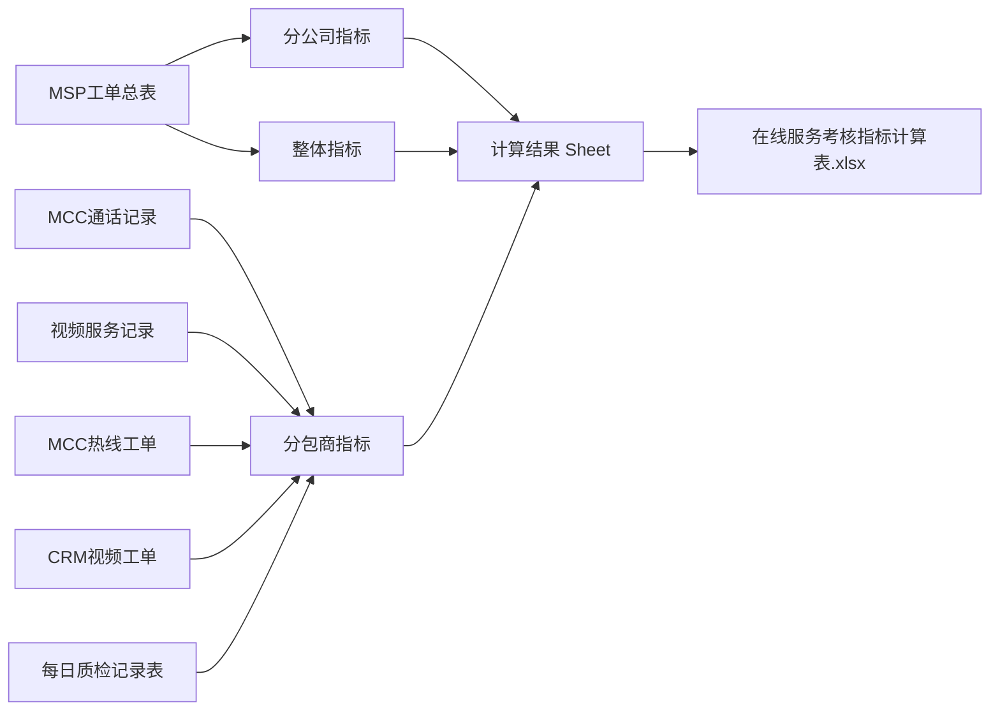
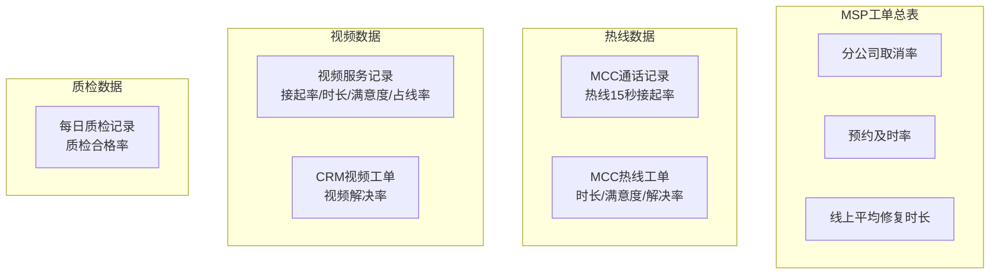
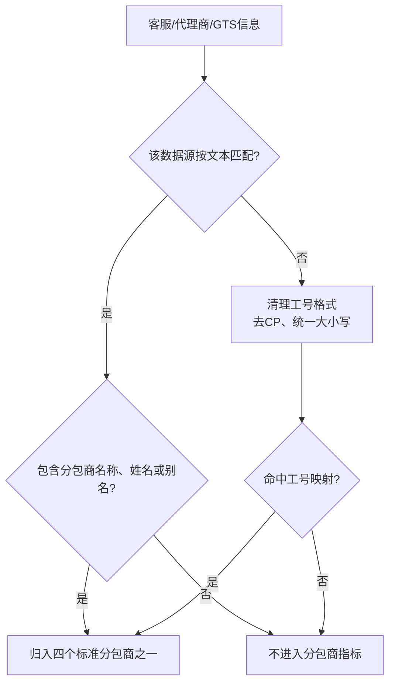
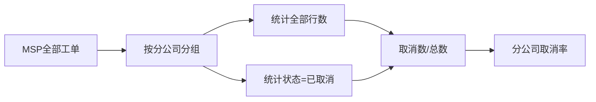
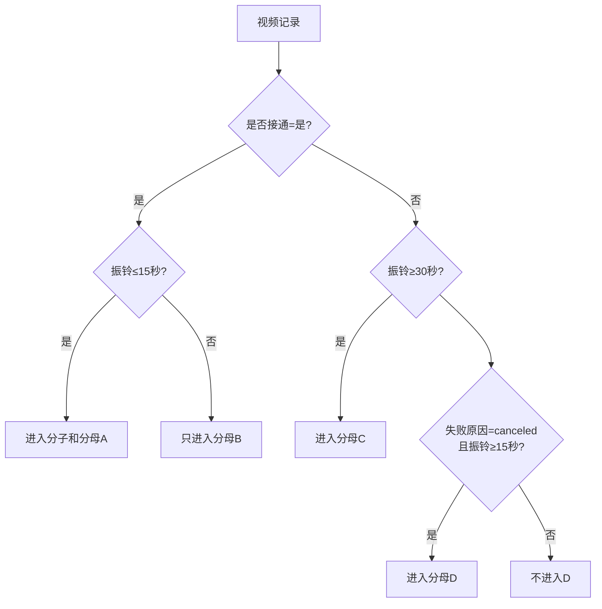
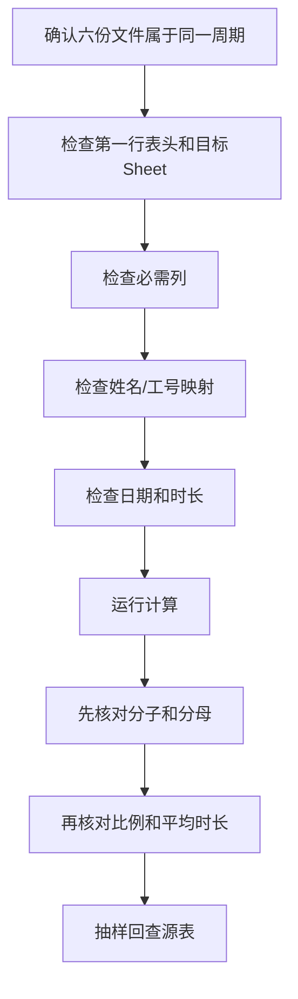

# 在线服务考核指标 Excel 读取与计算业务说明

> 适用模块：在线服务考核指标  
> 适用读者：在线服务运营、考核指标维护、数据提供及复核人员  
> 说明目标：讲清楚上传哪些表、读取哪些列、每条数据如何归属、每个指标如何计算，以及结果如何输出。本文不展开程序设计。

## 1. 模块最终产出什么

系统一次接收 6 份 Excel 或 CSV，将结果分成三个层级：

1. **分公司指标**：计算每个分公司的工单数量、取消数量和取消率。
2. **整体指标**：计算全体在线服务工单的预约及时率和平均修复时长。
3. **分包商指标**：分别计算迪诺、科海、庆余堂和尚肯的接起率、处理时长、满意度、质检合格率、解决率和占线率。



### 1.1 必须先明确的业务边界

- 系统**不会自动按月份、季度或年度筛选**。上传文件中有多少行，就在对应指标规则下处理多少行。因此，六份文件必须由业务人员提前限定为同一个考核周期。
- 系统**不会按工单号、通话 ID 或人员去重**。除非某个指标明确写了特殊分母，否则每一行都作为一条独立业务记录。
- 页面没有额外的业务筛选器，计算范围就是六份上传文件的有效读取范围。

---

# 2. 六份源表怎么读取

## 2.1 文件、Sheet 和表头规则

支持格式：

- Excel：`.xlsx`、`.xlsm`、`.xls`
- 文本表格：`.csv`

Excel 读取规则：

- `MSP工单总表`：优先读取`MSP工单原始数据`Sheet；不存在时读取第一个 Sheet。
- `每日质检记录表`：优先读取`质检表格`Sheet；不存在时读取第一个 Sheet。
- 其余四份 Excel：读取第一个 Sheet。
- 不会自动扫描多个 Sheet，也不会合并多个 Sheet。

CSV 读取规则：

- 自动尝试 UTF-16、UTF-8、GB18030、GBK。
- 自动尝试制表符和英文逗号分隔。

表头规则：

- 第一行必须是表头。
- 表头前后的空格会清除。
- 除“扣分”字段外，必需列名必须与本文列名一致，不做别名推测。
- 任一文件缺少必需列，整次计算停止并提示缺失字段。

文件名不参与业务判断。文件上传到哪个卡片位置，就按哪个源表角色读取。

## 2.2 六份源表与指标关系

| 上传位置 | 主要产出指标 |
| --- | --- |
| MSP工单总表 | 分公司工单取消率、在线服务工单预约及时率、平均修复时长（线上） |
| MCC通话记录 | 热线15秒接起率 |
| 视频服务记录 | 视频15秒接起率、平均在线工单处理时长、视频满意度、视频占线率 |
| MCC热线工单 | 平均在线工单处理时长、热线满意度、热线解决率 |
| CRM视频工单 | 视频解决率 |
| 每日质检记录表 | 质检合格率 |



## 2.3 MSP工单总表

| 必需列 | 如何使用 |
| --- | --- |
| `工单状态` | 判断是否为`已取消`；用于取消率和预约及时率 |
| `分公司` | 分公司指标的分组依据 |
| `申告渠道` | 判断是否属于在线服务渠道 |
| `首次派单时间` | 预约及时率、平均修复时长的起点 |
| `预约完成时间` | 预约及时率的终点 |
| `服务结束时间` | 平均修复时长的终点 |

系统认可的在线服务渠道只有以下五个精确值：

| 在线服务渠道 |
| --- |
| 热线申告 |
| 微信视频申告 |
| 一键报修申告 |
| 微信申告 |
| 远程申告 |

例如`001_热线申告`、`热线`不会自动转成`热线申告`，因此不进入整体在线服务指标。

## 2.4 MCC通话记录

| 必需列 | 如何使用 |
| --- | --- |
| `相关客服` | 通过分包商名称、客服姓名或别名识别分包商 |
| `响铃时间` | 转为秒后判断是否小于等于15秒 |

每条匹配到分包商的通话记录都进入该分包商热线接起率分母。

## 2.5 视频服务记录

| 必需列 | 如何使用 |
| --- | --- |
| `客服工号` | 通过本地工号映射识别分包商 |
| `振铃时长` | 视频15秒接起率的时间判断 |
| `是否接通` | 区分已接通和未接通 |
| `失败原因` | 未接通时判断是否为`canceled` |
| `通话时间` | 参与平均在线工单处理时长 |
| `评价` | 计算视频满意度 |
| `排队时长` | 判断是否占线，阈值为大于3秒 |

## 2.6 MCC热线工单

| 必需列 | 如何使用 |
| --- | --- |
| `受理客服` | 通过分包商名称、客服姓名或别名识别分包商 |
| `创建时间` | 热线处理时长起点 |
| `关闭时间` | 热线处理时长终点 |
| `短信满意度结果` | 按1、2、3三档折算热线满意度 |
| `受理单(service call)状态` | 计算热线解决率 |

## 2.7 CRM视频工单

| 必需列 | 如何使用 |
| --- | --- |
| `负责GTS编号` | 优先通过文本别名或工号映射识别分包商 |
| `负责GTS` | 编号未匹配时，再通过姓名、分包商文本或工号识别 |
| `用户状态` | 计算视频解决率 |

分包商识别顺序：

```text
负责GTS编号中的分包商/人员文本
  -> 负责GTS编号中的工号
  -> 负责GTS中的分包商/人员文本
  -> 负责GTS中的工号
```

## 2.8 每日质检记录表

| 必需列 | 如何使用 |
| --- | --- |
| `代理商` | 通过分包商名称、人员姓名或别名识别分包商 |
| 第一个以`扣分`开头的列 | 判断该条质检是否合格 |

注意：

- 若有多个“扣分...”列，只读取 Excel 中最靠前的一个。
- 扣分单元格为空，视为合格。
- 只要单元格有内容，就视为不合格；数字`0`也是非空，因此当前会判为不合格。

---

# 3. 分包商如何匹配

系统固定输出四个分包商：迪诺、科海、庆余堂、尚肯。即使某分包商没有匹配记录，结果中仍保留一行，比例显示`N/A`，分子和分母为0。

## 3.1 文本匹配

文本采用“包含”关系。例如`四川迪诺-陈银亭`会识别为迪诺。

| 标准分包商 | 可识别文本 |
| --- | --- |
| 迪诺 | 迪诺、四川迪诺、陈银亭、吴昌翼、赵平、马上、杨洪 |
| 科海 | 科海、河北科海、温彦朝、李勇健、杨计正、佟健阳、佟建阳、秦敬国 |
| 庆余堂 | 庆余堂、龚世杰、金苗苗 |
| 尚肯 | 尚肯、西安尚肯、孙欣 |

文本匹配用于`相关客服`、`受理客服`、`负责GTS编号`、`负责GTS`、`代理商`。

## 3.2 工号匹配

| 标准分包商 | 可识别工号 |
| --- | --- |
| 迪诺 | 59990080、S100018415、S100002594、S100002595、S100007767、S100000290 |
| 科海 | S100003619、S100020775、S100033043、S100030770、S100004649 |
| 庆余堂 | S100005735、S100003537 |
| 尚肯 | S100004229 |

工号会进行以下归一：

- `100018415.0`转成不带小数的编号。
- 移除开头的`CP`。
- 忽略英文字母大小写。
- 部分不带`S`的编号会尝试补`S`后匹配。



未匹配记录不会报错，也不会进入任何分包商分子或分母；当前没有未匹配记录或脏数据导出。

---

# 4. 通用计算和显示规则

## 4.1 百分比

```text
比例 = 分子 / 分母
```

- 百分比保留两位小数。
- 分母为0时显示`N/A`。
- 结果表同时输出比例、分子和分母。

## 4.2 时长

系统先统一转为秒，再换算为小时。

| 原始格式 | 解释 |
| --- | --- |
| 数字`15` | 15秒 |
| `15秒` | 15秒 |
| `1.5min` | 90秒 |
| `01:30` | 1分30秒 |
| `01:02:30` | 1小时2分30秒 |
| Excel时间对象 | 按时、分、秒转换 |

无法识别的时长不进入总时长，但对应行在部分指标中仍进入分母。日期差按“结束时间-开始时间”计算。时长结果以小时显示并保留两位小数。

---

# 5. 分公司指标

## 5.1 分公司工单取消率

数据源：MSP工单总表。先按`分公司`分组，分公司为空的行不生成分公司结果。

```text
工单总数量 = 该分公司全部MSP行数
已取消工单数量 = 工单状态精确等于“已取消”的行数
分公司工单取消率 = 已取消工单数量 / 工单总数量
```

该指标不筛选申告渠道，在线和非在线渠道都进入分公司总数。

| 分公司 | MSP总行数 | 已取消 | 取消率 |
| --- | ---: | ---: | ---: |
| 武汉分公司 | 200 | 10 | 5.00% |
| 深圳分公司 | 150 | 0 | 0.00% |



---

# 6. 整体指标

## 6.1 在线服务工单预约及时率

先筛选五类在线服务渠道，再排除`工单状态=已取消`。

```text
预约耗时 = 预约完成时间 - 首次派单时间
及时工单 = 预约耗时≤30分钟
预约及时率 = 及时工单数 / 在线服务渠道且未取消的工单数
```

分母包含时间为空或格式错误的在线未取消工单；这些行不进入分子。当前没有要求时间差必须大于等于0，因此负数时间异常也可能因“≤30分钟”进入及时分子。

| 记录 | 时间情况 | 进入分母 | 进入分子 |
| --- | --- | --- | --- |
| A | 20分钟 | 是 | 是 |
| B | 45分钟 | 是 | 否 |
| C | 时间为空 | 是 | 否 |
| D | -10分钟 | 是 | 是，当前未排除负值 |

上述示例的预约及时率为`2/4=50.00%`。

## 6.2 平均修复时长（线上）

数据范围是五类在线服务渠道工单，**包含已取消工单**。

```text
单条修复时长 = 服务结束时间 - 首次派单时间
修复总时长 = 所有可计算且>0的单条修复时长之和
平均修复时长 = 修复总时长 / 在线服务渠道工单总行数
```

分母包含：已取消工单、时间为空、格式错误、时间差≤0的在线工单。异常行不增加总时长，但仍占一个分母，因此时间缺失较多时可能拉低平均值。

示例：2小时、4小时、1条时间为空，则平均值为`(2+4)/3=2.00小时`。

---

# 7. 分包商指标

以下指标对四个分包商分别计算。

## 7.1 热线15秒接起率

数据源：MCC通话记录。

```text
分母 = 当前分包商全部MCC通话记录
分子 = 响铃时间≤15秒的记录
热线15秒接起率 = 分子 / 分母
```

响铃时间为空或无法识别时，仍进入分母，不进入分子。例如100条通话中85条≤15秒，结果为85.00%。

## 7.2 视频15秒接起率

数据源：视频服务记录。分母是业务定制口径，不是视频总行数。

| 类别 | 条件 | 分子 | 分母 |
| --- | --- | --- | --- |
| A | 是否接通=`是`且振铃≤15秒 | 是 | 是 |
| B | 是否接通=`是`且振铃>15秒 | 否 | 是 |
| C | 是否接通=`否`且振铃≥30秒 | 否 | 是 |
| D | 是否接通=`否`、失败原因=`canceled`且振铃≥15秒 | 否 | 是 |

```text
视频15秒分子 = A
视频15秒分母 = A+B+C+D
视频15秒接起率 = A/(A+B+C+D)
```

注意：

- `是否接通`要求精确为`是/否`，失败原因要求小写`canceled`。
- 不满足A/B/C/D的行不进入该指标分母。
- C和D不互斥。若同一行满足“未接通、canceled、振铃≥30秒”，当前会同时计入C和D，分母累计两次。

例如A=70、B=10、C=15、D=5，则接起率为70.00%。



## 7.3 平均在线工单处理时长

数据源：MCC热线工单+视频服务记录。

```text
热线总时长 = 有效且>0的(关闭时间-创建时间)之和
视频总时长 = 视频“通话时间”之和
在线处理工单数 = MCC热线工单行数 + 视频服务记录行数
平均处理时长 = (热线总时长+视频总时长) / 在线处理工单数
```

分母不按工单号去重。热线时间无效或≤0、视频通话时间为空时，时长按0贡献，但该行仍进入分母。

示例：热线8条共16小时，视频12条共4小时，平均处理时长=`20/20=1.00小时`。

## 7.4 热线满意度

数据源：MCC热线工单的`短信满意度结果`。

| 原始值 | 折算分 |
| ---: | ---: |
| 1 | 100分 |
| 2 | 80分 |
| 3 | 60分 |

其他值和空值不进入样本数。

```text
样本数 = 1档数量+2档数量+3档数量
热线满意度 = (1档×100+2档×80+3档×60) / 样本数
```

例如1档6条、2档3条、3档1条，满意度为90.00%。

## 7.5 视频满意度

数据源：视频服务记录的`评价`。只接受数字1至5。

```text
样本数 = 评价为1至5的记录数
视频满意度 = 有效评价总分 / (样本数×5)
```

例如评价5、5、4、4、2，总分20、满分25，满意度为80.00%。

## 7.6 质检合格率

数据源：每日质检记录表。

```text
质检总数 = 当前分包商全部质检记录
质检不合格数 = 第一个“扣分...”字段非空的记录
质检合格数 = 质检总数-质检不合格数
质检合格率 = 质检合格数 / 质检总数
```

| 扣分字段 | 当前判定 |
| --- | --- |
| 空白 | 合格 |
| `-2` | 不合格 |
| `服务用语扣2分` | 不合格 |
| `0` | 不合格，因为单元格非空 |

例如50条质检、8条扣分非空，合格率=`42/50=84.00%`。

## 7.7 热线解决率

数据源：MCC热线工单的`受理单(service call)状态`。

```text
分子 = 状态“技术支持解决”的记录数
分母 = “技术支持解决”+“派工完成”的记录数
热线解决率 = 分子 / 分母
```

其他状态不进入分母。例如技术支持解决80条、派工完成20条，结果80.00%。

## 7.8 视频解决率

数据源：CRM视频工单的`用户状态`。

```text
分子 = 状态“技术支持解决”的记录数
分母 = “技术支持解决”+“转FSM平台派工”的记录数
视频解决率 = 分子 / 分母
```

其他状态不进入分母。例如技术支持解决45条、转FSM平台派工5条，结果90.00%。

## 7.9 视频占线率

数据源：视频服务记录。

```text
分子 = 排队时长>3秒的记录
分母 = 当前分包商全部视频服务记录
视频占线率 = 分子 / 分母
```

排队时长为空或无法识别时仍进入分母、不进入分子。例如200条视频中30条排队>3秒，占线率15.00%。

---

# 8. 结果文件如何组织

输出文件名：`在线服务考核指标计算表_{任务编号}.xlsx`。

## 8.1 `计算结果` Sheet

| 区域 | 内容 |
| --- | --- |
| 分公司指标 | 分公司、工单总数量、已取消数量、取消率 |
| 整体指标 | 指标、分子说明、分子值、分母说明、分母值、结果 |
| 分包商指标 | 四个分包商的比例、分子、分母、时长和样本数 |

页面预览默认只展示分包商指标，不代表结果文件只有分包商数据。

## 8.2 `计算逻辑` Sheet

额外写入10类指标的简要公式和数据来源，随结果文件一起流转。

## 8.3 是否包含源表

- 未勾选“包含源表”：只输出`计算结果`和`计算逻辑`，更快、文件更小。
- 勾选：增加六个源表Sheet，便于审计。

源表Sheet：源表-MSP工单总表、源表-MCC通话记录、源表-视频服务记录、源表-MCC热线工单、源表-CRM视频工单、源表-每日质检记录。

---

# 9. 排除和异常处理

| 情况 | 系统处理 |
| --- | --- |
| 任一上传位置缺文件 | 不能开始计算 |
| 格式不是Excel/CSV | 整次失败 |
| 必需列缺失 | 整次失败并提示字段 |
| 非目标Sheet中有数据 | 不读取 |
| 分公司为空 | 不生成分公司指标，但仍可能参与MSP整体指标 |
| 申告渠道不是五个标准值 | 不进入整体指标，仍参与分公司取消率 |
| 客服/工号/GTS/代理商未匹配 | 不进入任何分包商指标 |
| 日期或时长无法识别 | 通常不进分子/总时长，部分指标仍计入分母 |
| 满意度不在有效分值 | 不进入满意度样本 |
| 解决状态不在规定集合 | 不进入解决率分母 |

当前没有脏数据表，也不会列出未匹配分包商的原始行。应对照源表总行数与各分包商分母，检查是否大量未匹配。

---

# 10. 业务复核流程



建议重点检查：

1. 六份源表周期是否一致。
2. MSP申告渠道是否使用五个标准名称。
3. 四个分包商姓名和工号是否都在映射中。
4. 视频`是否接通`是否为`是/否`，失败原因是否为小写`canceled`。
5. 质检表第一个“扣分”列是否正确，合格记录是否真正为空。
6. 是否存在结束时间早于开始时间。
7. 先核对分子和分母，再核对百分比。
8. 分包商全为`N/A`时先排查映射，不直接判断没有业务数据。

---

# 11. 指标速查表

| 指标 | 数据源 | 分子 | 分母 |
| --- | --- | --- | --- |
| 分公司工单取消率 | MSP | 状态=已取消 | 该分公司全部MSP行 |
| 在线服务工单预约及时率 | MSP | 在线、未取消且预约耗时≤30分钟 | 在线、未取消工单 |
| 平均修复时长（线上） | MSP | 在线工单有效正向修复时长之和 | 全部在线工单行数，含已取消和时间异常 |
| 热线15秒接起率 | MCC通话 | 响铃≤15秒 | 当前分包商全部通话 |
| 视频15秒接起率 | 视频服务 | 接通且振铃≤15秒 | A+B+C+D定制口径 |
| 平均在线工单处理时长 | MCC热线+视频 | 热线有效时长+视频通话时长 | 热线行数+视频行数 |
| 热线满意度 | MCC热线 | 1/2/3档按100/80/60折算 | 1/2/3档样本数 |
| 视频满意度 | 视频服务 | 1至5分评价总分 | 样本数×5 |
| 质检合格率 | 每日质检 | 扣分字段为空 | 当前分包商全部质检 |
| 热线解决率 | MCC热线 | 技术支持解决 | 技术支持解决+派工完成 |
| 视频解决率 | CRM视频 | 技术支持解决 | 技术支持解决+转FSM平台派工 |
| 视频占线率 | 视频服务 | 排队时长>3秒 | 当前分包商全部视频记录 |
