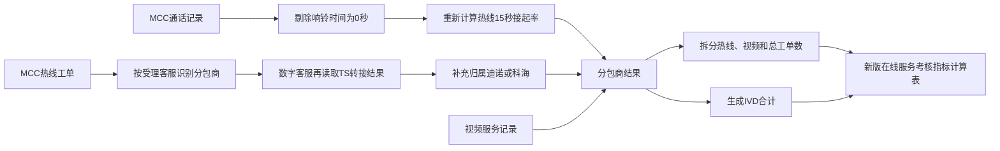
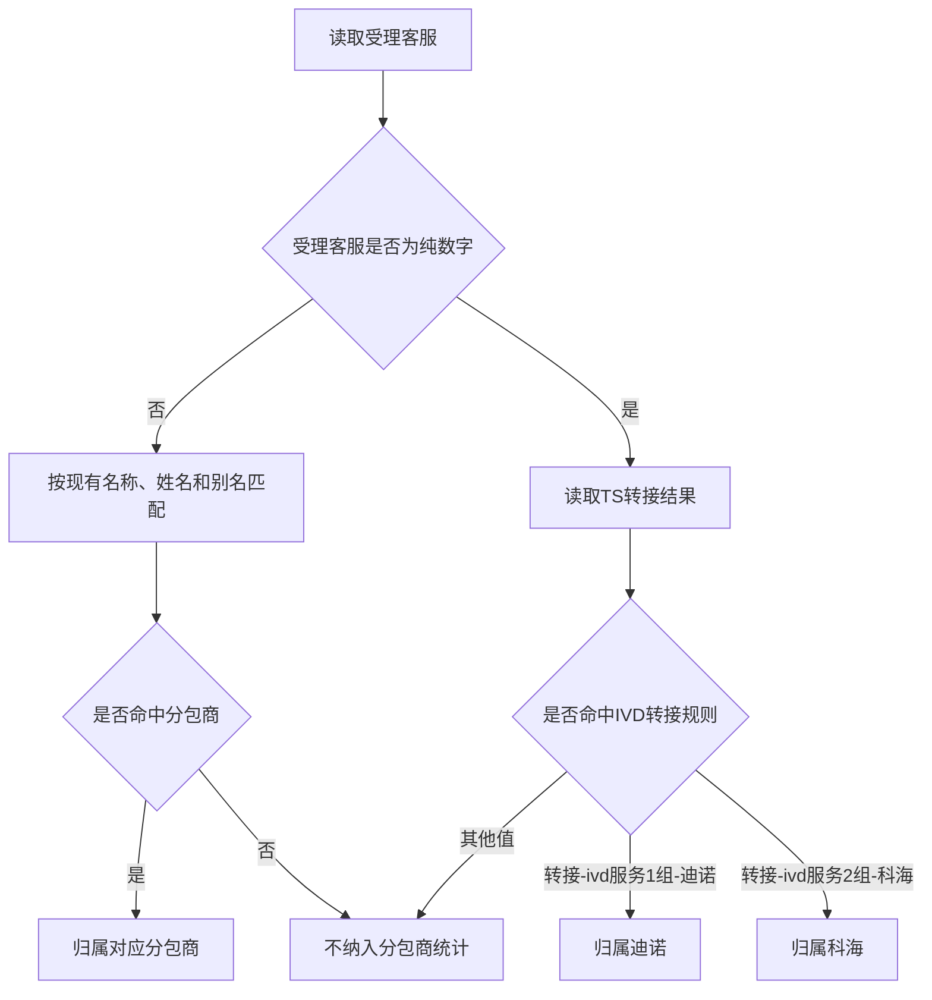
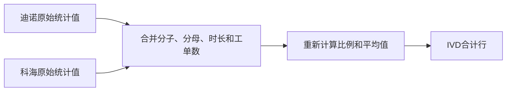

# 在线服务考核指标计算逻辑变更需求

> 文档状态：需求已确认，待开发  
> 确认日期：2026-07-27  
> 适用模块：在线服务考核指标  
> 适用结果：在线服务考核指标计算表  
> 本文范围：只描述业务需求和验收标准，不包含程序设计。

---

# 1. 变更目的

本次调整主要解决四个业务问题：

1. MCC 通话记录中存在响铃时间为 0 秒的数据，这些数据不应参与热线 15 秒接起率。
2. MCC 热线工单中的部分`受理客服`是数字，无法通过原有姓名和分包商文本识别，需要通过`TS转接结果`补充分包商归属。
3. 现有结果只展示迪诺、科海、庆余堂和尚肯，需要增加迪诺与科海合并后的`IVD合计`。
4. 原有`在线处理工单数`未区分热线和视频，需要拆分来源并保留总数。



---

# 2. 变更范围

## 2.1 本次需要调整

- 热线 15 秒接起率的分子和分母。
- MCC 热线工单的分包商识别。
- 分包商结果行。
- 在线处理工单数字段。
- IVD 合计的全部分包商指标。
- 结果表中的计算逻辑说明。

## 2.2 本次不调整

- 视频 15 秒接起率的 A、B、C、D 计算规则。
- 分公司工单取消率。
- 在线服务预约及时率。
- 线上平均修复时长。
- 迪诺、科海、庆余堂和尚肯原有姓名、别名和工号映射。
- 热线满意度、视频满意度、质检、解决率和占线率的基础公式。
- 原始 Excel 文件的 Sheet 名称。
- 其他业务模块。

---

# 3. 需求一：热线15秒接起率剔除0秒记录

## 3.1 数据来源

使用`MCC通话记录`中的：

| 字段 | 用途 |
| --- | --- |
| `相关客服` | 识别记录属于哪个分包商 |
| `响铃时间` | 判断是否为 0 秒以及是否在 15 秒内接起 |

## 3.2 新计算范围

先按照现有分包商映射，将 MCC 通话记录归属到迪诺、科海、庆余堂或尚肯。

在每个分包商内部，先剔除响铃时间换算后等于 0 秒的记录。

以下形式均视为 0 秒：

- 数字`0`
- 文本`0`
- `0秒`
- `00:00`
- 其他能够明确换算为 0 秒的标准时长格式

## 3.3 新公式

```text
有效热线通话记录
= 当前分包商全部MCC通话记录
- 响铃时间为0秒的记录
```

```text
热线15秒分子
= 有效热线通话记录中响铃时间大于0秒且小于等于15秒的记录数
```

```text
热线15秒分母
= 有效热线通话记录总数
```

```text
热线15秒接起率
= 热线15秒分子 ÷ 热线15秒分母
```

## 3.4 空值和异常值

本次只新增“剔除明确为 0 秒”的规则，其他情况保持原口径：

| 响铃时间 | 分子 | 分母 |
| --- | --- | --- |
| 0 秒 | 不计 | 不计 |
| 大于 0 秒且小于等于 15 秒 | 计入 | 计入 |
| 大于 15 秒 | 不计 | 计入 |
| 空白或无法识别 | 不计 | 计入 |

如果分母为 0，结果显示`N/A`。

## 3.5 示例

某分包商有以下 6 条 MCC 通话：

| 记录 | 响铃时间 | 处理结果 |
| --- | ---: | --- |
| A | 0秒 | 分子、分母都剔除 |
| B | 10秒 | 分子和分母都计入 |
| C | 15秒 | 分子和分母都计入 |
| D | 20秒 | 只计入分母 |
| E | 空白 | 只计入分母 |
| F | 无法识别 | 只计入分母 |

```text
热线15秒分子 = 2
热线15秒分母 = 5
热线15秒接起率 = 2 ÷ 5 = 40.00%
```

---

# 4. 需求二：数字受理客服通过TS转接结果归属

## 4.1 业务背景

MCC 热线工单原来只通过`受理客服`中的分包商名称、客服姓名或别名识别渠道。

部分联通客服在`受理客服`中只显示数字，无法通过原规则判断属于迪诺还是科海，因此需要读取`TS转接结果`。

## 4.2 使用字段

数据源：`MCC热线工单`。

| 字段 | 用途 |
| --- | --- |
| `受理客服` | 优先按照原有文本规则识别；数字值触发补充判断 |
| `TS转接结果` | 当受理客服为数字时，判断该工单转接给迪诺还是科海 |

## 4.3 分包商识别顺序



## 4.4 确认的转接映射

| `受理客服`情况 | `TS转接结果` | 最终归属 |
| --- | --- | --- |
| 数字 | `转接-ivd服务1组-迪诺` | 迪诺 |
| 数字 | `转接-ivd服务2组-科海` | 科海 |
| 数字 | `无需转接` | 不纳入迪诺、科海 |
| 数字 | `转接成功` | 不纳入迪诺、科海 |
| 数字 | 各类`转接失败...` | 不纳入迪诺、科海 |
| 数字 | 空白或其他值 | 不纳入迪诺、科海 |
| 非数字 | 能命中现有分包商映射 | 使用现有映射结果 |
| 非数字 | 无法命中现有分包商映射 | 不纳入分包商统计 |

`受理客服`中的数字包括：

- Excel 数字单元格
- 只包含数字的文本
- Excel 产生的数字加`.0`形式

## 4.5 影响的指标

通过`TS转接结果`新增归属的 MCC 热线工单，要与原来通过`受理客服`识别的工单完全一样参与统计。

会受到影响的字段包括：

- 在线处理热线工单数
- 在线处理总工单数
- 平均在线工单处理时长
- 热线满意度
- 热线满意度样本数
- 热线解决率
- 热线解决分子
- 热线解决分母
- IVD 合计中的对应指标

不会受到影响的指标：

- 热线 15 秒接起率，因为该指标来自另一张`MCC通话记录`。
- 视频相关指标。
- 质检指标。
- MSP 相关指标。

## 4.6 示例

| 受理客服 | TS转接结果 | 归属 |
| --- | --- | --- |
| 陈银亭 | 无需转接 | 迪诺，使用原姓名映射 |
| 10086 | 转接-ivd服务1组-迪诺 | 迪诺 |
| 10010 | 转接-ivd服务2组-科海 | 科海 |
| 10001 | 无需转接 | 不纳入 |
| 10002 | 转接失败-忙碌 | 不纳入 |
| 未知客服 | 转接-ivd服务1组-迪诺 | 不纳入，因为只有数字受理客服才读取转接结果 |

---

# 5. 需求三：增加IVD合计

## 5.1 展示位置

在分包商结果中增加一行`IVD合计`，展示顺序为：

```text
迪诺
科海
IVD合计
庆余堂
尚肯
```

IVD 合计只包含：

- 迪诺
- 科海

不包含庆余堂和尚肯。

## 5.2 合计原则

IVD 合计不能直接对迪诺和科海的百分比或平均时长做算术平均。

正确原则是：

1. 先合并迪诺、科海的分子。
2. 再合并迪诺、科海的分母。
3. 使用合并后的分子和分母重新计算比例。
4. 平均时长使用合并后的总时长除以合并后的总工单数。



## 5.3 各指标合计逻辑

| IVD 合计字段 | 合计方式 |
| --- | --- |
| 热线 15 秒分子 | 迪诺热线分子 + 科海热线分子 |
| 热线 15 秒分母 | 迪诺热线分母 + 科海热线分母 |
| 热线 15 秒接起率 | IVD 热线分子 ÷ IVD 热线分母 |
| 视频 15 秒分子 | 迪诺视频分子 + 科海视频分子 |
| 视频 15 秒分母 | 迪诺视频分母 + 科海视频分母 |
| 视频 15 秒接起率 | IVD 视频分子 ÷ IVD 视频分母 |
| 在线处理热线工单数 | 迪诺热线工单数 + 科海热线工单数 |
| 在线处理视频工单数 | 迪诺视频工单数 + 科海视频工单数 |
| 在线处理总工单数 | IVD 热线工单数 + IVD 视频工单数 |
| 平均在线工单处理时长 | 迪诺和科海的有效热线、视频总时长 ÷ IVD 在线处理总工单数 |
| 热线满意度样本数 | 迪诺样本数 + 科海样本数 |
| 热线满意度 | 合并 1、2、3 档样本后，按 100、80、60 分重新计算 |
| 视频满意度样本数 | 迪诺样本数 + 科海样本数 |
| 视频满意度 | 合并有效评分总分 ÷（合并样本数 × 5） |
| 质检合格数 | 迪诺合格数 + 科海合格数 |
| 质检总数 | 迪诺总数 + 科海总数 |
| 质检合格率 | IVD 合格数 ÷ IVD 质检总数 |
| 热线解决分子 | 迪诺热线解决分子 + 科海热线解决分子 |
| 热线解决分母 | 迪诺热线解决分母 + 科海热线解决分母 |
| 热线解决率 | IVD 热线解决分子 ÷ IVD 热线解决分母 |
| 视频解决分子 | 迪诺视频解决分子 + 科海视频解决分子 |
| 视频解决分母 | 迪诺视频解决分母 + 科海视频解决分母 |
| 视频解决率 | IVD 视频解决分子 ÷ IVD 视频解决分母 |
| 视频占线分子 | 迪诺占线分子 + 科海占线分子 |
| 视频占线分母 | 迪诺占线分母 + 科海占线分母 |
| 视频占线率 | IVD 占线分子 ÷ IVD 占线分母 |

分母为 0 的比例显示`N/A`。

## 5.4 合计示例

| 分包商 | 热线 15 秒分子 | 热线 15 秒分母 | 接起率 |
| --- | ---: | ---: | ---: |
| 迪诺 | 80 | 100 | 80.00% |
| 科海 | 70 | 90 | 77.78% |

错误算法：

```text
（80.00% + 77.78%）÷ 2 = 78.89%
```

正确算法：

```text
IVD热线15秒分子 = 80 + 70 = 150
IVD热线15秒分母 = 100 + 90 = 190
IVD热线15秒接起率 = 150 ÷ 190 = 78.95%
```

---

# 6. 需求四：拆分在线处理工单数

## 6.1 字段变更

原字段：

```text
在线处理工单数
```

修改为：

```text
在线处理总工单数
在线处理热线工单数
在线处理视频工单数
```

建议在结果表中按以下顺序展示：

```text
平均在线工单处理时长
在线处理总工单数
在线处理热线工单数
在线处理视频工单数
```

## 6.2 计算公式

### 在线处理热线工单数

```text
在线处理热线工单数
= MCC热线工单中最终归属该分包商的全部记录数
```

其中包括：

- 通过`受理客服`姓名、分包商名称或别名识别的记录。
- 数字受理客服通过`TS转接结果`新识别的记录。

不按照热线状态筛选，也不按工单号去重。

### 在线处理视频工单数

```text
在线处理视频工单数
= 视频服务记录中通过客服工号归属该分包商的全部记录数
```

不要求`是否接通=是`，不按会话 ID 或工单号去重。

### 在线处理总工单数

```text
在线处理总工单数
= 在线处理热线工单数
+ 在线处理视频工单数
```

必须满足：

```text
在线处理总工单数
= 在线处理热线工单数 + 在线处理视频工单数
```

## 6.3 与其他指标的关系

| 指标 | 与三个工单数字段的关系 |
| --- | --- |
| 平均在线工单处理时长 | 使用`在线处理总工单数`作为分母 |
| 热线解决分母 | 只是热线工单中状态为技术支持解决或派工完成的子集 |
| 视频解决分母 | 来自 CRM 视频工单，与在线处理视频工单数不是同一张源表 |
| 热线满意度样本数 | 只是热线工单中满意度为 1、2、3 的子集 |
| 视频满意度样本数 | 只是视频服务记录中评价为 1 至 5 的子集 |
| 视频占线分母 | 等于该分包商全部视频服务记录数，因此应与在线处理视频工单数一致 |
| 视频 15 秒分母 | 使用 A+B+C+D 定制口径，不要求等于在线处理视频工单数 |

## 6.4 示例

某分包商最终归属数据：

```text
MCC热线工单：120条
视频服务记录：80条
```

结果：

```text
在线处理热线工单数 = 120
在线处理视频工单数 = 80
在线处理总工单数 = 120 + 80 = 200
```

即使部分热线工单时间为空，或部分视频记录未接通，这些记录仍计入对应工单数。

---

# 7. 新版结果表结构

## 7.1 分包商行

结果至少包含以下 5 行：

| 顺序 | 分包商 |
| ---: | --- |
| 1 | 迪诺 |
| 2 | 科海 |
| 3 | IVD合计 |
| 4 | 庆余堂 |
| 5 | 尚肯 |

## 7.2 需要调整的字段

| 原字段 | 新字段或处理 |
| --- | --- |
| `在线处理工单数` | 重命名为`在线处理总工单数` |
| 无 | 新增`在线处理热线工单数` |
| 无 | 新增`在线处理视频工单数` |
| 无 | 新增`IVD合计`结果行 |
| `热线15秒分子` | 剔除 0 秒记录后重新计算 |
| `热线15秒分母` | 剔除 0 秒记录后重新计算 |
| `热线15秒接起率` | 使用新分子、新分母重新计算 |

其他原有字段继续保留。

## 7.3 计算逻辑说明

生成结果文件中的`计算逻辑`Sheet需要同步说明：

1. 热线 15 秒接起率剔除 0 秒记录。
2. 数字受理客服通过`TS转接结果`归属迪诺或科海。
3. IVD 合计只汇总迪诺和科海。
4. 在线处理工单数拆分为热线、视频和总数。
5. IVD 比例和平均值使用合并后的分子、分母和总时长重新计算。

---

# 8. 验收标准

## 8.1 热线15秒接起率

- 响铃时间为 0 秒的记录不进入分子。
- 响铃时间为 0 秒的记录不进入分母。
- 大于 0 秒且小于等于 15 秒的记录同时进入分子、分母。
- 大于 15 秒的记录只进入分母。
- 空白或无法识别的记录保持原口径，只进入分母。
- 分母为 0 时显示`N/A`。

## 8.2 数字受理客服

- 数字客服且转接结果为`转接-ivd服务1组-迪诺`时归属迪诺。
- 数字客服且转接结果为`转接-ivd服务2组-科海`时归属科海。
- 数字客服且转接结果为无需、失败、空白或其他值时不纳入。
- 非数字客服继续使用原有映射。
- 非数字客服无法命中原映射时，不因转接结果而归属。
- 新归属记录参与全部 MCC 热线分包商指标。

## 8.3 IVD合计

- 结果中在科海下方出现`IVD合计`。
- IVD 合计只包含迪诺和科海。
- 数量字段等于迪诺与科海之和。
- 比例字段使用合并后的分子、分母重新计算。
- 平均时长使用合并总时长除以合并总工单数。
- 不允许直接平均迪诺、科海的百分比或平均时长。

## 8.4 在线处理工单数

- 原`在线处理工单数`改为`在线处理总工单数`。
- 新增`在线处理热线工单数`。
- 新增`在线处理视频工单数`。
- 每个分包商必须满足：

```text
在线处理总工单数
= 在线处理热线工单数 + 在线处理视频工单数
```

- IVD 合计也必须满足相同关系。

## 8.5 结果一致性

- 原有四个分包商继续保留。
- 庆余堂和尚肯不受数字受理客服 IVD 转接规则影响。
- 未涉及的指标公式保持不变。
- 结果表和`计算逻辑`Sheet中的文字说明必须一致。
- 如果页面预览展示相同分包商字段，应与下载结果表保持一致。

---

# 9. 验收数据建议

正式上线前建议准备一组小规模测试数据，至少包含：

| 测试类型 | 最少需要的数据 |
| --- | --- |
| 热线响铃 | 0秒、10秒、15秒、20秒、空白、异常文本 |
| 数字客服转接 | 迪诺、科海、无需转接、转接失败、空白 |
| 原有客服识别 | 迪诺姓名、科海姓名、庆余堂姓名、尚肯姓名 |
| 热线状态 | 技术支持解决、派工完成、其他状态 |
| 视频记录 | 已接通、未接通、不同振铃时长 |
| 满意度 | 热线1、2、3及无效值；视频1至5及无效值 |
| 质检 | 空白扣分、非空扣分、数字0 |

测试完成后重点核对：

1. 0 秒记录是否从热线接起率分子、分母中同时消失。
2. 数字客服转接后，迪诺和科海的热线工单数是否增加正确。
3. 三个在线处理工单数是否满足加总关系。
4. IVD 合计是否等于迪诺、科海的重新汇总结果。
5. IVD 比例是否没有使用简单平均。
6. 庆余堂和尚肯原有结果是否未发生无关变化。

---

# 10. 最终确认口径

```text
热线15秒接起率：
剔除响铃时间为0秒的MCC通话记录，分子和分母都不计算这些记录。

数字受理客服：
只在受理客服为数字时读取TS转接结果；
服务1组迪诺归迪诺，服务2组科海归科海，其他结果不纳入。

IVD合计：
只合并迪诺和科海，所有比例和平均值均按合并后的基础数据重新计算。

在线处理工单数：
拆分为热线工单数、视频工单数和总工单数；
总工单数必须等于热线工单数加视频工单数。
```
