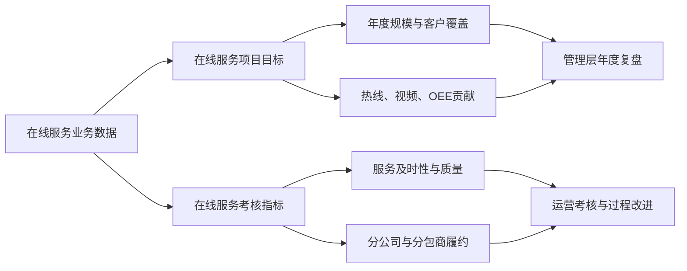
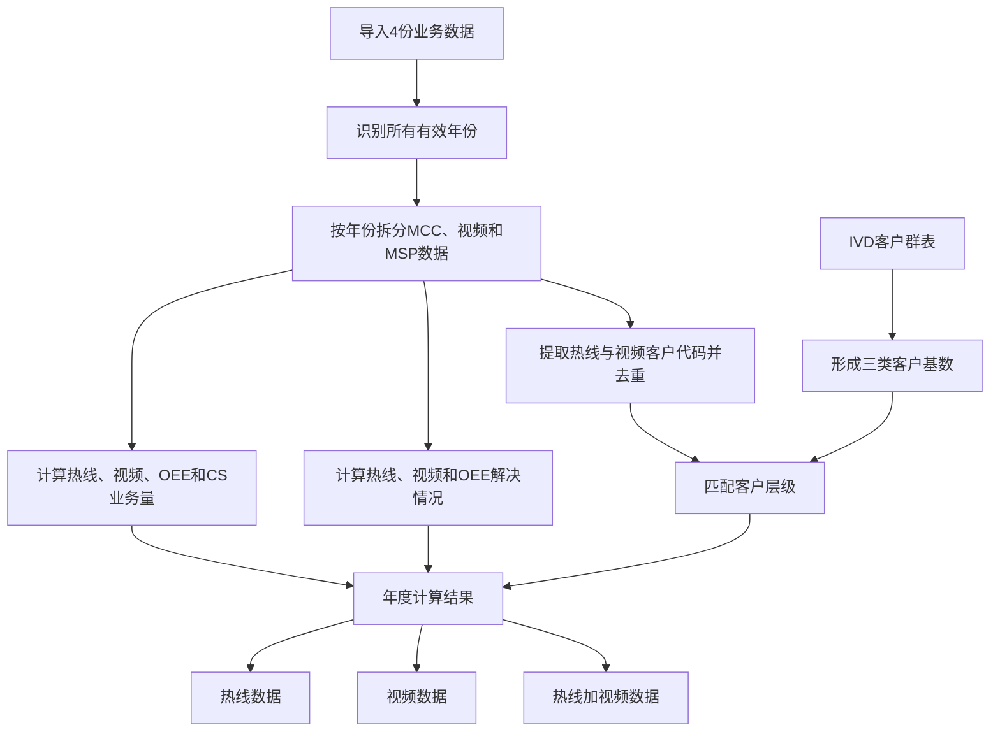
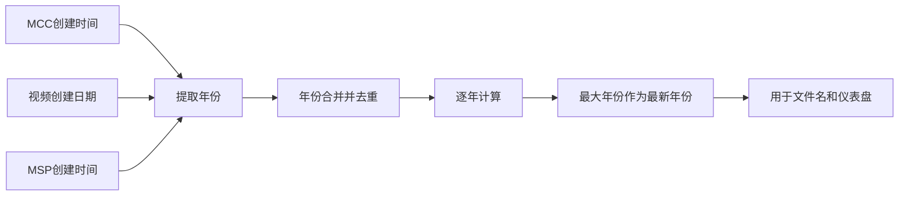
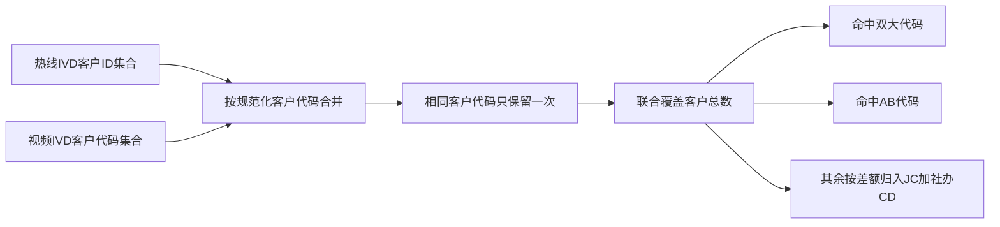
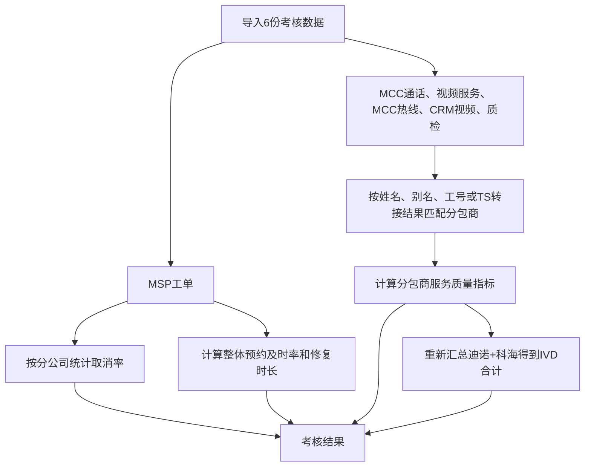
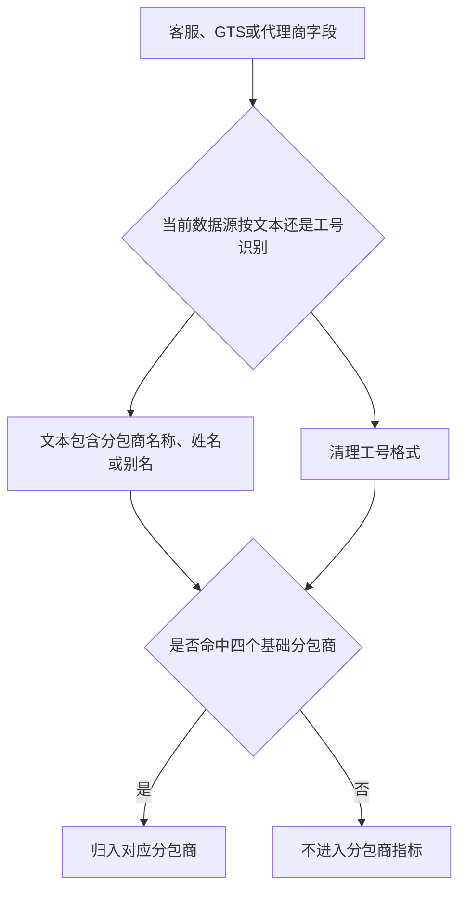
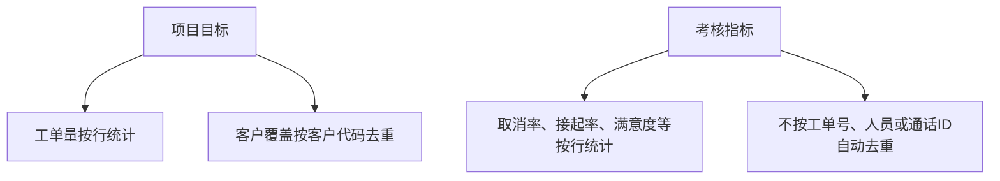
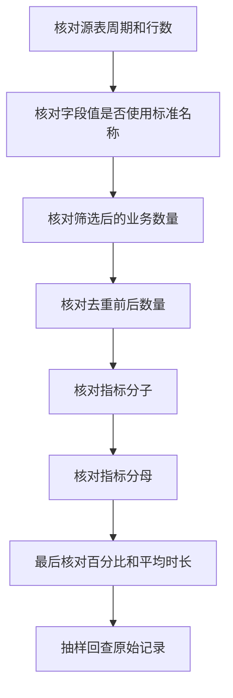

# 在线服务项目目标与在线服务考核指标业务说明

> 适用模块：在线服务项目目标、在线服务考核指标  
> 适用读者：在线服务运营人员、业务管理人员、考核负责人、数据提供人员和结果复核人员  
> 文档目的：讲清两个模块分别解决什么问题、Excel 如何读取、指标如何计算，以及两套口径的区别和联系。本文以业务规则为主，不展开程序实现。
> 实现基线：2026-08-03 当前代码与导出结果。

---

# 阅读导航

| 想了解的内容 | 建议阅读 |
| --- | --- |
| 两个模块分别有什么用 | 第 1 章 |
| 在线服务项目目标如何读取和计算 | 第 2 章 |
| 在线服务考核指标如何读取和计算 | 第 3 章 |
| 两个模块到底哪里不同 | 第 4 章 |
| 两个模块如何配合使用 | 第 5 章 |
| 导入前和结果复核要检查什么 | 第 6 章 |
| 当前业务口径有哪些风险 | 第 7 章 |
| 快速查看全部指标公式 | 第 8 章 |

---

# 1. 先说结论

“在线服务项目目标”和“在线服务考核指标”不是简单的新旧版本关系，而是两套并行的业务分析口径。

| 模块 | 主要回答的问题 | 典型使用场景 |
| --- | --- | --- |
| 在线服务项目目标 | 一年内产生了多少在线业务、解决了多少、覆盖了多少客户 | 年度目标跟踪、业务规模复盘、管理汇报、客户覆盖分析 |
| 在线服务考核指标 | 一个考核周期内，服务是否及时、稳定、满意，分包商履约情况如何 | 月度或季度考核、过程质量管理、分包商绩效评估 |

可以直白地理解为：

- **项目目标看结果和规模**：业务量、解决量、客户覆盖、渠道贡献。
- **考核指标看过程和质量**：接起速度、处理时长、满意度、质检、解决率、占线率。



## 1.1 两套模块共同使用的数据领域

两个模块都会涉及热线、视频和 MSP 工单，但读取的表格角色和计算目的不同。

| 数据领域 | 项目目标中的用途 | 考核指标中的用途 |
| --- | --- | --- |
| MSP 工单 | 统计 OEE、CS 申告、在线工单构成和解决情况 | 统计分公司取消率、预约及时率、平均修复时长 |
| MCC 热线 | 统计热线工单量、解决情况和客户覆盖 | MCC 通话用于接起率；MCC 热线工单用于时长、满意度和解决率 |
| 视频业务 | 统计视频工单量、解决情况和客户覆盖 | 视频服务记录用于接起率、时长、满意度和占线率；CRM 视频工单用于解决率 |
| 客户基础信息 | 使用 IVD 客户群表计算客户总量和覆盖率 | 不使用客户群表 |
| 质检数据 | 不使用 | 用于分包商质检合格率 |

## 1.2 当前数据是否自动共用

当前两个页面分别导入数据，**不会自动复用另一页面已经上传的文件**。

- 项目目标必须上传自己的 4 份数据。
- 考核指标必须上传自己的 6 份数据。
- 即使文件来自相同业务系统，也必须按对应页面要求上传。
- 两个模块计算完成后分别生成独立结果文件。

---

# 2. 在线服务项目目标

## 2.1 业务目标

在线服务项目目标用于按年份汇总以下内容：

1. 热线、视频、OEE、CS 申告分别产生了多少工单。
2. 热线、视频和 OEE 分别解决了多少工单。
3. 各类在线服务在整体业务中的占比。
4. IVD 客户总量是多少。
5. 热线、视频以及热线加视频共同覆盖了多少 IVD 客户。
6. 双大、县域加社办 AB、JC 加社办 CD 三类客户分别覆盖了多少。
7. 最新年份和历年趋势如何。



## 2.2 必须上传的 4 份文件

| 上传位置 | Excel 必需 Sheet | 主要用途 |
| --- | --- | --- |
| MCC 热线原始数据 | `MCC热线原始数据` | 热线业务量、热线解决情况、热线客户覆盖 |
| 视频工单原始数据 | `视频工单原始数据` | 视频业务量、视频解决情况、视频客户覆盖 |
| MSP 工单原始数据 | `MSP工单原始数据` | OEE、CS 申告和在线工单构成 |
| IVD 客户群表 | `双大`、`县域+社办AB类`、`JC+社办CD类` | 客户总量、客户层级和覆盖率分母 |

四份文件缺少任意一份时，不能开始计算。

### 2.2.1 文件和 Sheet 识别规则

- 支持 Excel 和 CSV。
- Excel 按指定 Sheet 读取，不会自动从其他 Sheet 猜测数据。
- 上传文件名需要包含对应业务名称，例如`MCC热线`、`视频工单`、`MSP工单`或`IVD客户群表`。
- 表头前后的空格会清理，业务字段内容前后的空格也会清理。
- 必需列缺失时，整次计算停止。
- 第一行必须是字段名称。

IVD 客户群表如果使用 CSV，必须额外提供客户层级列，用于区分：

- `双大`
- `县域+社办AB类`
- `JC+社办CD类`

## 2.3 MCC 热线原始数据怎么读取

### 2.3.1 必需字段

| 字段 | 业务用途 |
| --- | --- |
| `客户ID` | 识别和去重热线覆盖客户，并与 IVD 客户群匹配 |
| `客户名称` | 结果明细和人工复核 |
| `受理单(service call)状态` | 计算热线已解决数量和热线解决率 |
| `创建时间` | 识别工单所属年份 |
| `申告渠道` | 输入校验和业务保留字段；当前热线年度总量不按该字段过滤 |
| `VIP客户级别` | 输入校验和结果保留字段；当前核心指标不直接使用 |
| 一个或多个以`大产线`开头的字段 | 判断该热线记录是否属于 IVD 客户覆盖范围 |

### 2.3.2 年度热线基础数量

```text
热线工单数量 = 当前年份 MCC 数据总行数
热线已解决工单数量 = 当前年份状态精确等于“技术支持解决”的行数
```

注意：

- 热线工单数量当前不按`申告渠道`过滤。
- 热线工单数量当前不按状态过滤。
- 一行按一张业务记录计算，不按工单号去重。
- 创建时间无法识别的记录无法归入任何年份。

### 2.3.3 热线项目解决率

热线项目解决率使用业务状态集合计算。

分子状态：

- `无需技术支持`
- `座席解决`
- `坐席解决`
- `技术支持解决`

分母状态：

- 上述全部分子状态
- `派工完成`

```text
热线项目解决率
= 分子状态记录数
÷（分子状态记录数 + 派工完成记录数）
```

其他状态不进入该解决率分母。

## 2.4 视频工单原始数据怎么读取

### 2.4.1 必需字段

| 字段 | 业务用途 |
| --- | --- |
| `创建日期` | 识别视频工单所属年份 |
| `用户状态` | 计算视频已解决数量和视频解决率 |
| `客户代码` | 识别和去重视频覆盖客户，并与 IVD 客户群匹配 |
| `客户` | 结果保留和人工复核；当前覆盖计算仍以客户代码为准 |
| `产品线` | 判断是否进入 IVD 视频客户覆盖 |
| `VIP客户级别` | 输入校验和结果保留字段；当前核心指标不直接使用 |

### 2.4.2 年度视频基础数量

```text
视频工单数量 = 当前年份视频数据总行数
视频已解决工单数量 = 当前年份用户状态精确等于“技术支持解决”的行数
```

注意：

- 视频工单数量是年度全部视频行数。
- 视频工单数量不按产品线或状态过滤。
- 一行按一张业务记录计算，不按工单号去重。

### 2.4.3 视频项目解决率

视频项目解决率的分子状态为：

- `无需技术支持`
- `座席解决`
- `坐席解决`
- `技术支持解决`

分母状态为：

- 上述全部分子状态
- `转FSM平台派工`

```text
视频项目解决率
= 分子状态记录数
÷（分子状态记录数 + 转FSM平台派工记录数）
```

其他状态不进入该解决率分母。

## 2.5 MSP 工单原始数据怎么读取

### 2.5.1 必需字段

| 字段 | 业务用途 |
| --- | --- |
| `创建时间` | 识别 MSP 工单所属年份 |
| `申告渠道` | 区分远程申告和 CS 申告 |
| `工作方式` | 判断远程申告是否由电话指导或远程解决完成 |
| `工单类型` | 将 CS 申告分为维修服务和临床服务 |

### 2.5.2 OEE 工单

```text
OEE工单总数量
= 当前年份申告渠道等于“远程申告”的MSP行数
```

```text
OEE已解决工单数量
= 申告渠道等于“远程申告”
且工作方式属于“电话指导”或“远程解决”的MSP行数
```

```text
OEE工单解决率
= OEE已解决工单数量 ÷ OEE工单总数量
```

### 2.5.3 CS 申告

```text
CS申告（维修）
= 申告渠道等于“CS申告”
且工单类型等于“维修服务”的行数
```

```text
CS申告（问题处理）
= 申告渠道等于“CS申告”
且工单类型等于“临床服务”的行数
```

```text
CS申告总量
= CS申告（维修）+ CS申告（问题处理）
```

## 2.6 IVD 客户群表怎么读取

### 2.6.1 双大客户

读取`双大`Sheet：

| 字段 | 用途 |
| --- | --- |
| `客户代码` | 与热线客户 ID、视频客户代码匹配 |
| `客户名称` | 人工复核 |

```text
双大客户数量 = 双大Sheet的数据行数
```

### 2.6.2 县域加社办 AB 客户

读取`县域+社办AB类`Sheet：

| 字段 | 用途 |
| --- | --- |
| `客户代码` | 与热线客户 ID、视频客户代码匹配 |
| `客户名称` | 人工复核 |

```text
县域加社办AB客户数量 = 该Sheet的数据行数
```

### 2.6.3 JC 加社办 CD 客户

读取`JC+社办CD类`Sheet的`客户数量`列。

```text
JC加社办CD客户数量 = “客户数量”列转成数字后求和
```

不能转成数字的内容按 0 处理。

### 2.6.4 IVD 客户总量

```text
IVD客户总量 = 双大客户数量 + 县域加社办AB客户数量 + JC加社办CD客户数量
```

同一份 IVD 客户群表作为所有年份的客户基数，不会按年份自动更换。

## 2.7 年份如何确定

系统同时读取：

- MCC 的`创建时间`
- 视频的`创建日期`
- MSP 的`创建时间`

将三个字段中能够识别的年份合并、去重，并按年份升序分别计算。



例如三个文件中出现 2024、2025、2026，结果会分别生成三行年度结果，文件名使用最大年份 2026。

## 2.8 客户代码如何标准化和去重

客户代码会做以下处理：

- 清除前后空格。
- Excel 数字`123.0`规范为`123`。
- 整数保持为整数字符串。
- 空客户代码不进入客户覆盖。

当前不会自动：

- 去除客户代码前导 0。
- 转换不同系统之间的客户编码。
- 根据客户名称代替客户代码参与视频覆盖。
- 合并“同一家客户但客户代码不同”的记录。

因此，热线和视频使用不同客户代码时，系统可能把同一家客户看成两个客户。

## 2.9 热线客户覆盖如何计算

### 2.9.1 数据范围

先筛选：

1. MCC 创建时间属于当前年份。
2. 任意一个以`大产线`开头的字段精确等于`IVD`。
3. `客户ID`非空。

当前热线覆盖不再额外按申告渠道或工单状态过滤。

### 2.9.2 覆盖客户数

```text
热线覆盖客户数量
= 当前年份IVD热线记录中的非空客户ID去重数量
```

### 2.9.3 客户层级

```text
热线双大覆盖数
= 热线覆盖客户ID与双大客户代码的交集数量
```

```text
热线AB覆盖数
= 热线覆盖客户ID与县域加社办AB客户代码的交集数量
```

```text
热线JC覆盖数
= MAX（热线覆盖总数 - 双大覆盖数 - AB覆盖数，0）
```

没有命中双大或 AB 的热线客户，按差额归入 JC 加社办 CD。

## 2.10 视频客户覆盖如何计算

### 2.10.1 数据范围

先筛选：

1. 视频创建日期属于当前年份。
2. `产品线`精确等于`血球`或`生化`。
3. `客户代码`非空。

当前视频覆盖不按`用户状态`过滤。

### 2.10.2 覆盖计算

```text
视频覆盖客户数量
= 筛选后客户代码的去重数量
```

```text
视频双大覆盖数
= 视频客户代码命中双大客户代码的数量
```

```text
视频AB覆盖数
= 视频客户代码命中县域加社办AB客户代码的数量
```

```text
视频JC覆盖数
= MAX（视频覆盖总数 - 双大覆盖数 - AB覆盖数，0）
```

当前视频客户名称只用于结果保留和人工检查，不代替客户代码匹配。

## 2.11 热线加视频联合覆盖

联合覆盖不是“热线覆盖数 + 视频覆盖数”直接相加，而是对两个客户集合取并集。

```text
联合覆盖客户集合
= 热线IVD客户ID集合 ∪ 视频IVD客户代码集合
```

```text
联合覆盖客户数量 = 联合集合去重后的数量
```



联合覆盖的准确性依赖热线`客户ID`和视频`客户代码`采用同一套编码。

## 2.12 项目目标的主要指标公式

### 2.12.1 在线工单总量

```text
在线工单总量 = 热线工单数量 + 视频工单数量 + OEE工单总数量 + CS申告总量
```

### 2.12.2 工单占比

```text
热线工单占比 = 热线工单数量 ÷ 在线工单总量
视频工单占比 = 视频工单数量 ÷ 在线工单总量
OEE工单占比 = OEE工单总数量 ÷ 在线工单总量
```

### 2.12.3 整体贡献类解决率

```text
热线整体解决率
= 状态为“技术支持解决”的热线数量
÷ 在线工单总量
```

```text
视频整体解决率
= 状态为“技术支持解决”的视频数量
÷ 在线工单总量
```

```text
MSP OEE单整体解决率
= OEE已解决工单数量
÷ 在线工单总量
```

这些指标表达某一类渠道对全部在线业务的解决贡献，不等于该渠道自身的解决率。

### 2.12.4 在线解决率整体

```text
在线解决率整体
=（热线技术支持解决数 + 视频技术支持解决数 + OEE已解决数）
÷（热线工单数 + 视频工单数 + OEE工单数）
```

该指标不把 CS 申告放进解决率分母。

### 2.12.5 整体在线工单占比

```text
整体在线工单占比
=（热线工单数 + 视频工单数 + OEE工单数）
÷ 在线工单总量
```

因为在线工单总量还包含 CS 申告，所以该比例用于观察热线、视频和 OEE 在整体统计口径中的占比。

### 2.12.6 客户覆盖率

```text
整体客户覆盖率 = 覆盖客户数量 ÷ IVD客户总量
双大客户覆盖率 = 双大覆盖客户数量 ÷ 双大客户数量
AB客户覆盖率 = AB覆盖客户数量 ÷ AB客户数量
JC客户覆盖率 = JC覆盖客户数量 ÷ JC客户数量
```

热线、视频和联合覆盖分别计算上述四类覆盖率。

所有比例保留两位小数；分母为 0 时显示`N/A`。

## 2.13 项目目标输出结果

输出文件名：

```text
在线服务项目目标计算表_最大年份.xlsx
```

实际任务处理中会带任务编号，下载时按最大年份命名。

结果工作簿包含：

| Sheet 或区域 | 内容 |
| --- | --- |
| `计算结果`的热线数据 | 每年热线业务量、解决率、覆盖率和 OEE 相关指标 |
| `计算结果`的视频数据 | 每年视频业务量、解决率、覆盖率和 OEE 相关指标 |
| `计算结果`的热线加视频数据 | 每年联合覆盖率、整体在线工单占比和在线解决率整体 |
| `计算逻辑` | 指标来源和计算说明 |
| 仪表盘 | 最新年份 KPI、覆盖率和趋势 |
| 源表 | 勾选“包含源表”时写入 |
| MCC 热线客户去重明细 | 勾选“包含源表”时写入，只展示最大年份 IVD 热线客户，每个客户 ID 保留第一条 |

---

# 3. 在线服务考核指标

## 3.1 业务目标

在线服务考核指标用于评价一个指定考核周期内的服务过程和服务质量，分为三层：

1. **分公司指标**：工单数量、取消数量和取消率。
2. **整体指标**：在线服务预约及时率、线上平均修复时长。
3. **分包商指标**：输出迪诺、科海、`IVD合计`、庆余堂和尚肯 5 行结果，计算接起率、处理时长、满意度、质检、解决率和占线率。`IVD合计`不是独立分包商，只合并迪诺和科海。



## 3.2 必须上传的 6 份文件

| 上传位置 | 读取方式 | 主要用途 |
| --- | --- | --- |
| MSP 工单总表 | 优先读取`MSP工单原始数据`Sheet，否则读取第一个 Sheet | 分公司取消率、预约及时率、平均修复时长 |
| MCC 通话记录 | 第一个 Sheet | 热线 15 秒接起率 |
| 视频服务记录 | 第一个 Sheet | 视频接起率、处理时长、满意度、占线率 |
| MCC 热线工单 | 第一个 Sheet | 分包商归属、处理时长、热线处理工单数、热线满意度、热线解决率 |
| CRM 视频工单 | 第一个 Sheet | 视频解决率 |
| 每日质检记录表 | 优先读取`质检表格`Sheet，否则读取第一个 Sheet | 质检合格率 |

六份文件缺少任意一份时，不能开始计算。

### 3.2.1 文件读取边界

- 支持 Excel 和 CSV。
- 文件名不参与业务判断，上传到哪个位置就按哪个数据源读取。
- 除 MSP 和质检表的优先 Sheet 外，不会合并多个 Sheet。
- 第一行必须是表头。
- 必需字段名要求一致。
- 任一必需字段缺失时，整次计算停止。

## 3.3 考核周期规则

考核指标不会自动识别月份、季度或年份，也不会按日期字段拆分。

```text
本次考核范围 = 六份上传文件各自包含的数据范围
```

因此业务人员必须提前保证：

- 六份文件属于同一个考核周期。
- 不要把月度表、季度表和年度表混在一次计算中。
- 若需要计算 2026 年 6 月，应先从各系统导出相同月份的数据。

当前考核指标均按业务规则逐行统计，不按工单号、通话 ID 或人员自动去重。按分公司或分包商归组不等于去重。

## 3.4 MSP 工单总表怎么读取

| 必需字段 | 业务用途 |
| --- | --- |
| `工单状态` | 判断是否为已取消 |
| `分公司` | 生成分公司取消率 |
| `申告渠道` | 判断是否属于在线服务渠道 |
| `首次派单时间` | 预约及时率和修复时长起点 |
| `预约完成时间` | 预约及时率终点 |
| `服务结束时间` | 修复时长终点 |

考核指标认可的在线服务渠道只有以下五个精确名称：

- `热线申告`
- `微信视频申告`
- `一键报修申告`
- `微信申告`
- `远程申告`

例如`001_热线申告`不等于`热线申告`，不会自动去掉编号前缀。

### 3.4.1 分公司工单取消率

```text
分公司工单总量 = 该分公司全部MSP行数
分公司已取消数量 = 工单状态等于“已取消”的行数
分公司取消率 = 已取消数量 ÷ 分公司工单总量
```

该指标不按申告渠道过滤。分公司为空的记录不生成分公司结果，但仍可能进入后面的整体指标。

### 3.4.2 在线服务预约及时率

先筛选：

1. 申告渠道属于五类在线服务渠道。
2. 工单状态不等于`已取消`。

```text
预约耗时 = 预约完成时间 - 首次派单时间
预约及时工单 = 预约耗时小于等于30分钟
预约及时率 = 预约及时工单数 ÷ 在线且未取消工单数
```

时间为空或格式错误的在线未取消工单仍进入分母，但不进入分子。

当前没有排除负数时间差，因此结束时间早于开始时间的异常记录也可能因“小于等于 30 分钟”被判为及时。

### 3.4.3 线上平均修复时长

先筛选五类在线服务渠道，但不排除已取消工单。

```text
单条修复时长 = 服务结束时间 - 首次派单时间
修复总时长 = 所有可识别且大于0的修复时长之和
平均修复时长 = 修复总时长 ÷ 在线服务工单总行数
```

已取消、时间为空、时间错误或时长小于等于 0 的在线工单仍进入分母，只是不增加总时长。

## 3.5 分包商如何识别

系统固定输出 5 行，顺序为：

- 迪诺
- 科海
- IVD合计（迪诺+科海）
- 庆余堂
- 尚肯

其中四个基础分包商可以通过名称、人员姓名、别名或客服工号识别。`IVD合计`不直接匹配源表，而是把迪诺和科海已匹配的基础记录合并后重新计算。

### 3.5.1 文本匹配

| 分包商 | 可识别文本 |
| --- | --- |
| 迪诺 | 迪诺、四川迪诺、陈银亭、吴昌翼、赵平、马上、杨洪 |
| 科海 | 科海、河北科海、温彦朝、李勇健、杨计正、佟健阳、佟建阳、秦敬国 |
| 庆余堂 | 庆余堂、龚世杰、金苗苗 |
| 尚肯 | 尚肯、西安尚肯、孙欣 |

文本使用包含匹配。例如`四川迪诺-陈银亭`会归入迪诺。

### 3.5.2 工号匹配

| 分包商 | 可识别工号 |
| --- | --- |
| 迪诺 | 59990080、S100018415、S100002594、S100002595、S100007767、S100000290 |
| 科海 | S100003619、S100020775、S100033043、S100030770、S100004649 |
| 庆余堂 | S100005735、S100003537 |
| 尚肯 | S100004229 |

工号会清除开头的`CP`、忽略英文大小写，并处理 Excel 产生的`.0`。



未匹配数据不会报错，也没有单独的脏数据导出，因此需要用源表总数和分包商分母进行人工核对。

### 3.5.3 MCC 热线工单的数字客服规则

`MCC热线工单`使用特殊的归属顺序：

1. `受理客服`不是纯数字时，只按现有分包商名称、人员姓名和别名包含匹配。
2. `受理客服`是数字、纯数字文本或数字加`.0`时，不再用该数字匹配工号，改读`TS转接结果`。
3. `TS转接结果`精确等于`转接-ivd服务1组-迪诺`时归属迪诺；精确等于`转接-ivd服务2组-科海`时归属科海。
4. 数字客服的其他转接结果，以及非数字但未命中别名的客服，均不进入分包商指标。

注意：非数字`受理客服`一旦命中别名，就按该别名归属，不会被`TS转接结果`改写。

## 3.6 MCC 通话记录

| 必需字段 | 业务用途 |
| --- | --- |
| `相关客服` | 通过姓名或别名归属分包商 |
| `响铃时间` | 计算热线 15 秒接起率 |

```text
热线15秒接起率分母 = 当前分包商中响铃时间不等于0秒的MCC通话记录
热线15秒接起率分子 = 响铃时间大于0秒且小于等于15秒的记录
热线15秒接起率 = 分子 ÷ 分母
```

响铃时间明确可换算为 0 秒时，分子和分母都剔除；包括数字`0`、文本`0`、`0秒`、`00:00`和零时长对象。空值或无法识别的记录仍进入分母，不进入分子。

## 3.7 视频服务记录

| 必需字段 | 业务用途 |
| --- | --- |
| `客服工号` | 通过工号归属分包商 |
| `振铃时长` | 视频 15 秒接起率 |
| `是否接通` | 区分接通与未接通 |
| `失败原因` | 识别取消呼叫 |
| `通话时间` | 平均在线工单处理时长 |
| `评价` | 视频满意度 |
| `排队时长` | 视频占线率 |

### 3.7.1 视频 15 秒接起率

| 类别 | 条件 | 是否进入分子 | 是否进入分母 |
| --- | --- | --- | --- |
| A | 接通=`是`且振铃小于等于 15 秒 | 是 | 是 |
| B | 接通=`是`且振铃大于 15 秒 | 否 | 是 |
| C | 接通=`否`且振铃大于等于 30 秒 | 否 | 是 |
| D | 接通=`否`、失败原因=`canceled`且振铃大于等于 15 秒 | 否 | 是 |

```text
视频15秒接起率 = A ÷（A+B+C+D）
```

当前 C 和 D 不是互斥条件。一条“未接通、canceled、振铃大于等于 30 秒”的记录会同时进入 C 和 D，分母累计两次。

### 3.7.2 视频满意度

只接受 1 至 5 的数字评价。

```text
视频满意度
= 有效评价总分
÷（有效评价数量 × 5）
```

### 3.7.3 视频占线率

```text
视频占线率分子 = 排队时长大于3秒的记录
视频占线率分母 = 当前分包商全部视频服务记录
视频占线率 = 分子 ÷ 分母
```

排队时长为空或无法识别时仍进入分母。

## 3.8 MCC 热线工单

| 必需字段 | 业务用途 |
| --- | --- |
| `受理客服` | 非数字值通过分包商名称、姓名或别名归属；数字值触发`TS转接结果`判断 |
| `TS转接结果` | 数字受理客服归属迪诺或科海的必需字段 |
| `创建时间` | 热线处理时长起点 |
| `关闭时间` | 热线处理时长终点 |
| `短信满意度结果` | 热线满意度 |
| `受理单(service call)状态` | 热线解决率 |

### 3.8.1 热线满意度

| 原始值 | 折算分 |
| ---: | ---: |
| 1 | 100 分 |
| 2 | 80 分 |
| 3 | 60 分 |

其他值和空值不进入满意度样本。

```text
热线满意度
=（1档数量×100 + 2档数量×80 + 3档数量×60）
÷ 有效样本数
```

### 3.8.2 热线解决率

```text
热线解决率分子 = 状态等于“技术支持解决”的记录
热线解决率分母 = 状态为“技术支持解决”或“派工完成”的记录
热线解决率 = 分子 ÷ 分母
```

其他状态不进入分母。

## 3.9 CRM 视频工单

| 必需字段 | 业务用途 |
| --- | --- |
| `负责GTS编号` | 优先通过文本或工号匹配分包商 |
| `负责GTS` | 编号未匹配时，再通过姓名、文本或工号匹配 |
| `用户状态` | 计算视频解决率 |

匹配顺序：

```text
负责GTS编号中的人员或分包商文本
→ 负责GTS编号中的工号
→ 负责GTS中的人员或分包商文本
→ 负责GTS中的工号
```

```text
视频解决率分子 = 状态等于“技术支持解决”的记录
视频解决率分母 = 状态为“技术支持解决”或“转FSM平台派工”的记录
视频解决率 = 分子 ÷ 分母
```

## 3.10 每日质检记录

| 必需字段 | 业务用途 |
| --- | --- |
| `代理商` | 通过文本归属分包商 |
| 第一个以`扣分`开头的字段 | 判断质检是否合格 |

```text
质检总数 = 当前分包商全部质检记录
质检不合格数 = 第一个扣分字段非空的记录数
质检合格数 = 质检总数 - 质检不合格数
质检合格率 = 质检合格数 ÷ 质检总数
```

当前只看第一个“扣分...”列：

- 空白判为合格。
- `-2`判为不合格。
- 文本说明判为不合格。
- 数字`0`也是非空，当前判为不合格。

## 3.11 平均在线工单处理时长

该指标合并 MCC 热线工单和视频服务记录。

```text
热线总时长
= 所有有效且大于0的（关闭时间 - 创建时间）之和
```

```text
视频总时长
= 视频服务记录“通话时间”之和
```

```text
在线处理热线工单数 = 当前分包商全部MCC热线工单行数
在线处理视频工单数 = 当前分包商全部视频服务记录行数
在线处理总工单数 = 在线处理热线工单数 + 在线处理视频工单数

平均在线工单处理时长
=（热线总时长 + 视频总时长）÷在线处理总工单数
```

三个工单数都在结果表中单独输出。这些数量不按工单号去重、不按状态筛选。时间无效的记录按 0 增加时长，但仍占一个分母。

### 3.11.1 IVD合计如何计算

`IVD合计`只合并迪诺和科海的已归属记录，不包含庆余堂和尚肯。系统先合并两家的原始基础数据，再重新计算所有指标：

- 数量类：直接基于迪诺+科海的记录统计。
- 比率类：先合并分子和分母，再相除。
- 平均时长：先合并有效总时长和总工单数，再相除。
- 满意度：先合并有效评价样本，再按原公式重算。

因此，`IVD合计`不是把迪诺和科海的百分比或平均时长做算术平均。

## 3.12 时长识别规则

系统会把不同格式统一换算为秒：

| 原始值 | 解释 |
| --- | --- |
| 数字`15` | 15 秒 |
| `15秒` | 15 秒 |
| `1.5min` | 90 秒 |
| `01:30` | 1 分 30 秒 |
| `01:02:30` | 1 小时 2 分 30 秒 |
| Excel 时间对象 | 按时、分、秒换算 |

平均时长最终以小时显示，保留两位小数。

所有比例保留两位小数；分母为 0 时显示`N/A`。结果表会同时保留分子、分母或相关样本数，方便业务复核。

## 3.13 考核指标输出结果

输出文件名：

```text
在线服务考核指标计算表.xlsx
```

结果工作簿包含：

| Sheet 或区域 | 内容 |
| --- | --- |
| `计算结果`的分公司指标 | 分公司工单量、取消量和取消率 |
| `计算结果`的整体指标 | 预约及时率和线上平均修复时长 |
| `计算结果`的分包商指标 | 迪诺、科海、`IVD合计`、庆余堂、尚肯 5 行的接起率、时长、热线/视频/总处理工单数、满意度、质检、解决率和占线率 |
| `计算逻辑` | 指标来源和简要公式 |
| 六份源表 | 勾选“包含源表”时写入 |

页面预览主要展示分包商指标，完整结果需要下载 Excel 查看。

---

# 4. 两个模块的核心区别

## 4.1 一张表看懂区别

| 对比项 | 在线服务项目目标 | 在线服务考核指标 |
| --- | --- | --- |
| 业务定位 | 年度经营结果和客户覆盖 | 周期服务质量和履约考核 |
| 时间口径 | 自动读取日期并按年份拆分 | 不自动拆分，上传什么周期就计算什么周期 |
| 输入文件数 | 4 份 | 6 份 |
| 主要分析对象 | 年份、业务渠道、客户层级 | 分公司、整体服务、分包商 |
| 是否计算客户覆盖 | 是 | 否 |
| 是否按客户去重 | 覆盖客户按客户代码去重 | 绝大多数指标按行统计，不去重 |
| 是否评价服务速度 | 否 | 是，15 秒接起率和 30 分钟预约及时率 |
| 是否评价满意度 | 否 | 是 |
| 是否评价质检 | 否 | 是 |
| 是否评价占线 | 否 | 是 |
| 分包商维度 | 无 | 四个基础分包商：迪诺、科海、庆余堂、尚肯；另输出迪诺+科海的`IVD合计` |
| 客户层级 | 双大、县域加社办 AB、JC 加社办 CD | 无 |
| 输出趋势 | 多年份年度趋势 | 单次上传周期结果 |
| 典型负责人 | 业务管理、年度项目负责人 | 运营管理、考核负责人 |

## 4.2 相同名称不代表相同口径

两个模块都有热线解决率和视频解决率，但分子范围不同。

### 项目目标热线解决率

```text
分子 = 无需技术支持 + 座席解决 + 坐席解决 + 技术支持解决
分母 = 分子 + 派工完成
```

### 考核指标热线解决率

```text
分子 = 技术支持解决
分母 = 技术支持解决 + 派工完成
```

### 项目目标视频解决率

```text
分子 = 无需技术支持 + 座席解决 + 坐席解决 + 技术支持解决
分母 = 分子 + 转FSM平台派工
```

### 考核指标视频解决率

```text
分子 = 技术支持解决
分母 = 技术支持解决 + 转FSM平台派工
```

假设热线状态为：

| 状态 | 数量 |
| --- | ---: |
| 技术支持解决 | 80 |
| 无需技术支持 | 10 |
| 座席解决 | 5 |
| 派工完成 | 5 |

则：

```text
项目目标热线解决率 =（80+10+5）÷（80+10+5+5）= 95.00%
考核指标热线解决率 = 80÷（80+5）= 94.12%
```

两个结果都正确，只是回答的问题不同。

## 4.3 MSP 渠道名称也不同

| 模块 | 认可的渠道值 |
| --- | --- |
| 项目目标 | OEE 使用`远程申告`，CS 使用`CS申告` |
| 考核指标 | `热线申告`、`微信视频申告`、`一键报修申告`、`微信申告`、`远程申告` |

项目目标 MCC 表中的`001_热线申告`等带编号渠道，目前不参与热线年度总量筛选；考核指标 MSP 表则要求不带编号的精确名称。

## 4.4 去重逻辑不同



因此不能直接把项目目标中的“覆盖客户数”与考核指标中的“服务记录数”作同比。

## 4.5 时间逻辑不同

| 项目目标 | 考核指标 |
| --- | --- |
| 自动从三份业务表提取年份 | 不识别考核周期 |
| 同一次导入可输出多个年份 | 一次导入代表一个完整考核周期 |
| 最大年份用于最新 KPI 和下载文件名 | 文件内容中的日期不决定结果分组 |

---

# 5. 两个模块的联系

## 5.1 共同形成完整管理闭环


推荐的使用顺序：

1. 用项目目标确认业务规模、客户覆盖和渠道贡献。
2. 找出覆盖不足、解决贡献不足或增长异常的年度指标。
3. 用考核指标检查相关周期内的服务过程。
4. 进一步定位到分公司或分包商。
5. 形成整改动作，并在下一考核周期复查。
6. 年度末再回到项目目标模块观察整体改善结果。

## 5.2 可以联合解释的业务问题

| 现象 | 项目目标提供的信息 | 考核指标提供的信息 | 可能的业务解释 |
| --- | --- | --- | --- |
| 工单量增加但解决率下降 | 年度工单规模和解决率 | 接起率、处理时长、占线率 | 服务资源可能不足 |
| 客户覆盖提高但满意度下降 | 覆盖客户增长 | 满意度和质检合格率 | 扩张速度可能超过服务承接能力 |
| OEE 业务占比低 | OEE 工单数量和占比 | 预约及时率、平均修复时长 | 远程服务使用不足或处理效率不高 |
| 某阶段热线解决率下降 | 年度热线解决趋势 | 分包商热线解决率和接起率 | 可定位到具体分包商或接听环节 |
| 视频覆盖增长缓慢 | 视频客户覆盖 | 视频接起率、满意度、占线率 | 视频入口体验或承接能力可能存在问题 |

## 5.3 不建议直接合并的指标

以下指标虽然名称相近，但不能未经口径转换直接相加或比较：

- 项目目标热线解决率与考核指标热线解决率。
- 项目目标视频解决率与考核指标视频解决率。
- 项目目标热线工单数与考核指标 MCC 通话记录数。
- 项目目标视频工单数与考核指标视频服务记录数。
- 项目目标客户覆盖数与考核指标服务记录分母。
- 项目目标年度数据与考核指标月度或季度数据。

---

# 6. 数据准备和复核要求

## 6.1 项目目标导入前检查

1. 四份文件是否齐全。
2. 文件名和指定 Sheet 是否正确。
3. MCC、视频和 MSP 的日期是否能识别。
4. MCC 是否至少有一个以`大产线`开头的字段。
5. IVD 相关 MCC 记录的大产线是否精确写为`IVD`。
6. 视频覆盖的产品线是否精确写为`血球`或`生化`。
7. 热线客户 ID 与视频客户代码是否采用同一套编码。
8. IVD 客户群表是否与需要分析的年份匹配。
9. 双大和 AB 的客户代码是否重复。
10. JC 的客户数量列是否全部为数字。

## 6.2 考核指标导入前检查

1. 六份文件是否齐全。
2. 六份文件是否属于同一考核周期。
3. MSP 的五类在线渠道名称是否精确。
4. 分公司字段是否为空或名称不统一。
5. 四个基础分包商的姓名、别名和工号是否都能命中当前映射。
6. MCC 热线工单是否包含`TS转接结果`，数字受理客服的转接值是否精确使用已配置的迪诺/科海文本。
7. MCC 通话的0秒、空值和无法识别响铃时间是否符合预期口径。
8. 视频`是否接通`是否为`是/否`。
9. 视频失败原因是否为小写`canceled`。
10. 时间字段是否存在结束时间早于开始时间。
11. 质检表第一个“扣分”列是否就是实际考核列。
12. 质检合格记录是否真正为空，避免数字 0 被判为不合格。

## 6.3 结果复核顺序



推荐先看分子、分母，再看百分比。只看最终百分比，很难发现未匹配、空值或口径不一致。

---

# 7. 业务口径风险提示

## 7.1 项目目标

- 热线年度总量按 MCC 年度全部行统计，不按申告渠道过滤。
- 热线覆盖按 IVD 大产线和客户 ID 计算，当前不按状态过滤。
- 视频年度总量按年度全部视频行统计，覆盖才筛选`血球`和`生化`。
- 视频覆盖只用客户代码，客户名称不替代客户代码。
- JC 覆盖采用差额法，不是逐条命中 JC 客户清单。
- IVD 客户基数对所有年份相同，跨年度对比时要确认客户群表版本。
- 热线与视频客户编码不一致时，联合覆盖可能重复计算。

## 7.2 考核指标

- 不自动按日期筛选，考核周期完全由上传文件决定。
- 多数指标按行统计，不自动去重。
- 未匹配到分包商的记录被排除，但当前没有未匹配明细导出。
- MCC 热线工单的数字`受理客服`只按`TS转接结果`归属；非数字未命中别名时不会回退使用转接结果。
- MCC 通话中明确为 0 秒的记录不进入热线 15 秒分子和分母；空值和异常值仍进入分母。
- `IVD合计`只代表迪诺+科海，不是四家分包商总计。
- 视频接起率 C、D 条件可重叠，特定记录会重复进入分母。
- 预约负时长可能被判为及时。
- 平均时长中的无效记录可能仍进入分母。
- 质检扣分值为数字 0 时，当前仍判为不合格。

---

# 8. 最终指标速查

## 8.1 在线服务项目目标

| 指标 | 主要数据源 | 核心分子 | 核心分母或基数 |
| --- | --- | --- | --- |
| 热线工单占比 | MCC、视频、MSP | 年度 MCC 行数 | 在线工单总量 |
| 视频工单占比 | MCC、视频、MSP | 年度视频行数 | 在线工单总量 |
| OEE 工单占比 | MSP | 远程申告数量 | 在线工单总量 |
| 热线整体解决率 | MCC | 技术支持解决数量 | 在线工单总量 |
| 视频整体解决率 | 视频 | 技术支持解决数量 | 在线工单总量 |
| 热线项目解决率 | MCC | 四类解决状态 | 四类解决状态加派工完成 |
| 视频项目解决率 | 视频 | 四类解决状态 | 四类解决状态加转 FSM 平台派工 |
| OEE 工单解决率 | MSP | 远程申告且电话指导或远程解决 | 远程申告总量 |
| 在线解决率整体 | MCC、视频、MSP | 热线解决加视频解决加 OEE 解决 | 热线加视频加 OEE 工单 |
| 热线客户覆盖率 | MCC、IVD 客户群 | IVD 热线客户 ID 去重数 | IVD 客户总量 |
| 视频客户覆盖率 | 视频、IVD 客户群 | 血球和生化客户代码去重数 | IVD 客户总量 |
| 联合客户覆盖率 | MCC、视频、IVD 客户群 | 热线与视频客户代码并集 | IVD 客户总量 |

## 8.2 在线服务考核指标

| 指标 | 主要数据源 | 核心分子 | 核心分母 |
| --- | --- | --- | --- |
| 分公司取消率 | MSP | 已取消工单 | 分公司全部 MSP 行 |
| 预约及时率 | MSP | 在线、未取消且预约耗时不超过 30 分钟 | 在线且未取消工单 |
| 线上平均修复时长 | MSP | 有效正向修复时长之和 | 全部在线工单行数 |
| 热线 15 秒接起率 | MCC 通话 | 响铃大于 0 且不超过 15 秒 | 剔除明确 0 秒后的分包商 MCC 通话（空值/异常值仍计入） |
| 视频 15 秒接起率 | 视频服务 | 接通且振铃不超过 15 秒 | A+B+C+D 定制口径 |
| 平均在线处理时长 | MCC 热线、视频服务 | 热线有效时长加视频通话时长 | 在线处理总工单数（另单列热线数、视频数） |
| IVD合计 | 迪诺、科海的各指标源表 | 合并迪诺+科海的基础分子/总时长 | 合并迪诺+科海的基础分母/总工单数后重算 |
| 热线满意度 | MCC 热线 | 1、2、3 档按 100、80、60 折算 | 有效满意度样本 |
| 视频满意度 | 视频服务 | 1 至 5 分评价总分 | 样本数乘以 5 |
| 质检合格率 | 每日质检 | 第一个扣分字段为空 | 分包商全部质检记录 |
| 热线解决率 | MCC 热线 | 技术支持解决 | 技术支持解决加派工完成 |
| 视频解决率 | CRM 视频 | 技术支持解决 | 技术支持解决加转 FSM 平台派工 |
| 视频占线率 | 视频服务 | 排队时长大于 3 秒 | 分包商全部视频记录 |

---

# 9. 一句话总结

```text
在线服务项目目标 = 从年度视角看“业务做了多少、解决了多少、覆盖了多少客户”

在线服务考核指标 = 从考核周期看“服务是否及时、稳定、满意，以及谁的履约表现好或差”
```

两套模块应同时保留：项目目标用于定方向和看结果，考核指标用于找原因和促改进。
